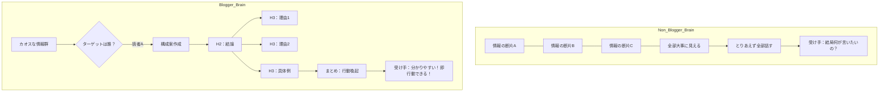

# Vol.50 ブログ運営能力の副業転用・資産構築完全攻略バイブル【深層対話】

[[00_知識マップ|⬅️ 00：知識マップへ戻る]]

## 📖 まえがき：なぜ「ブログ」こそが、全ての副業の“原点”にして“頂点”なのか

多くの人が誤解している。「ブログはオワコンだ」「今さら記事なんて読まれない」と。
しかし、ここで断言しよう。
**「ブログで稼ぐ」ことは難しくなったとしても、「ブログを運営する能力」の価値は暴騰している**、と。

なぜ、ブログ経験者は副業で圧倒的な成果を出しやすいのか？
逆に、なぜブログを通っていない人は、どれだけ高額なノウハウを買っても「点」でしか稼げず、すぐに消えていくのか？

その答えは、ブログ運営という行為そのものが、ビジネスに必要な**「思考のOS（オペレーティングシステム）」**を書き換える訓練だからである。

このバイブルでは、単なる「記事の書き方」ではない。
ブログ運営によって脳内で起きる**「構造化能力」「他者憑依能力（エンパシー）」「資産構築思考」「PDCAの自律駆動」**といった、目に見えない**「メタスキル」**の正体を、脳科学・ビジネス構造・心理学の観点から徹底的に解剖する。

そして、これから副業を始めるあなたへ。
もしブログをやっていなくても絶望する必要はない。このバイブルを読むことで、あなたは「10年間ブログを運営した達人」と同じ思考回路（ニューロン）を、脳内にインストールすることになるからだ。

さあ、始めよう。
これは「ブログ」の話ではない。「あなたの人生を資産化する」ための、最終講義である。

---

## 👥 参加エキスパート（深層対話メンバー）

本セッションは、以下の4名のスペシャリストによる「深層対話（Deep Dialogue）」形式で進行する。

1.  **🧠 Cognitive Architect (脳情報構造学者)**
    *   **役割**: 「書く」という行為が脳のワーキングメモリや論理思考回路に与える影響を分析。
    *   **視点**: なぜブロガーは「情報の整理」が異常に速いのか？ 非言語領域の脳内プロセスを言語化する。

2.  **🏗️ Asset Business Strategist (資産構築戦略家)**
    *   **役割**: 「労働（フロー）」と「資産（ストック）」のビジネスモデル比較。
    *   **視点**: 時間を切り売りする貧困思考と、寝ている間に稼ぐ富裕思考の決定的違いを「ブログ」という媒体を通して解説。

3.  **❤️ Empathy Marketing Psychologist (共感心理マーケター)**
    *   **役割**: ユーザーインサイト（検索意図）とLTV（生涯顧客価値）の分析。
    *   **視点**: なぜブロガーは「顔の見えない相手」の痛みを手に取るように理解できるのか？ サイコグラフィクスの達人としての側面。

4.  **🕵️ Crisis & Resilience Manager (危機管理・生存戦略家)**
    *   **役割**: 孤独、批判、アクセスゼロという「死の谷」を乗り越えるメンタルタフネス。
    *   **視点**: 失敗をデータと捉える「科学者マインド」の育成法。

5.  **🦄 Unico (PM・統括ファシリテーター)**
    *   **役割**: 全ての知見を統合し、読者が明日から使える「行動指針（アクションプラン）」へ昇華させる。

---

## 📑 目次（Contents）

1.  **第1章：【脳内革命】「情報構造化能力」— カオスを秩序に変える神のスキル**
    *   非ブロガーの脳は「ちらし寿司」、ブロガーの脳は「フランス料理のコース」
    *   H2、H3タグ思考がもたらす「人生のディレクトリ整理」
2.  **第2章：【他者憑依】「検索意図（インサイト）」— 1000km先の他人の痛みを想像する力**
    *   Google検索窓に打ち込まれた「血の叫び」を聞く訓練
    *   自分を消し、ペルソナになりきる「イタコ」の作法
3.  **第3章：【資産思考】「時間」を売るな、「仕組み」を植えろ**
    *   労働者マインド vs 投資家マインドの分岐点
    *   「過去の自分が、現在の自分を食わせる」という感覚
4.  **第4章：【孤独な戦い】アクセスゼロが生み出す「鋼のメンタル」**
    *   誰にも褒められない100記事が、あなたを作り変える
    *   PDCAじゃない、「DDDD（Do, Do, Do, Data）」だ
5.  **第5章：【AIとの融合】なぜブロガーはAI時代の支配者になるのか**
    *   プロンプトエンジニアリングの正体は「記事構成案」である
    *   AIを「外注ライター」として扱う指揮官としての作法
6.  **第6章：【非ブロガーへの処方箋】ブログを書かずに「ブログ脳」を手に入れる訓練法**
    *   日常会話の「見出し化」トレーニング
    *   他人の悩みの「Yahoo!知恵袋」脳内シミュレーション
7.  **最終章：メディア帝国への道 — あなたという存在を「コンテンツ」にする**

---

## Keywords & Tags
#BlogStrategy #InformationStructuring #StructuralThinking #ContentBusiness #SEO #EEAT #AI_CoWriting #PassiveIncome #LCIQ #TalentHacks #LogicalThinking #PersonalBranding #UserInsight #Resilience #DeepDialogue #Vol50 #00

---

## 第1章：【脳内革命】「情報構造化能力」— カオスを秩序に変える神のスキル

## 第1章：【脳内革命】「情報構造化能力」— カオスを秩序に変える神のスキル

### 🗣️ 深層対話パート 1：脳のOSが書き換わる瞬間

**Unico**: 
まずは核心から入りましょう。以前、「ブログが得意な人は副業で成功しやすい」という話がありましたが、その最大の理由は「文章が書けるから」ではありませんよね？

**Cognitive Architect (脳)**:
ええ、全く違います。「文章力」はただの出力結果（UI）に過ぎません。その裏側にある**「情報処理エンジン（Backend）」**のスペックが決定的に違うのです。
非ブロガーの脳内は、情報が並列に散らばった「ちらし寿司」状態です。美味しいけれど、どこから食べていいか分からないし、構造がない。
一方、熟練したブロガーの脳内は、完璧に計算された「フランス料理のコース」です。前菜（導入）、スープ（問題提起）、メイン（解決策）、デザート（未来の提示）という順序と階層構造が、息をするように構築されています。

**Asset Strategist (資産)**:
ビジネスにおいて、その違いは**「再現性」**として現れますね。
ちらし寿司脳の人は、たまたま上手くいくことはあっても、なぜ上手くいったか説明できない。だから部下に教えられないし、仕組み化できない。
コース料理脳（ブログ脳）の人は、全ての現象を「構造」で捉えています。「H2タグ（大見出し）」の中に「H3タグ（小見出し）」があるように、複雑なビジネス課題を**「親子関係」**や**「並列関係」**に瞬時に分解できるのです。

---

### 🧠 脳内ワークショップ：カオスを構造化する実演

**Unico**:
抽象度が高いので、ここで一つ**「実演」**をお願いできますか？
日常によくある「カオスな文章」を、ブログ脳の人がどう瞬時に構造化しているか、プロセスを見せてください。

**Cognitive Architect (脳)**:
喜んで。では、ある新入社員からの「支離滅裂な報告メール」を例にしましょう。

> **【カオスな原文】**
> 「お疲れ様です。A社の件ですが、部長が怒ってて、資料が足りないと言われました。あとB社の納期も遅れそうで、どうしましょう。A社は明日までに修正が必要で、B社は来週でいいんですが、部長はとにかくA社を先にやれと言ってます。でも私のPCの調子も悪くて…」

これが「ちらし寿司」です。事実、感情、納期、トラブルが全部混ぜこぜです。
これを受け取った上司は「で、俺は何をすればいいの？」とストレスを感じます。

**Unico**:
あるあるですね。これをブログ脳（構造化思考）で処理するとどうなりますか？

**Cognitive Architect (脳)**:
私なら、脳内で瞬時に以下のようにタグ付け（階層化）します。

1.  **H2：最優先事項（結論）** → A社の修正対応
2.  **H3：問題の所在（理由）** → 部長からの指摘（資料不足）
3.  **H3：アクション（解決策）** → 明日までに修正が必要
4.  **H2：次点の課題（保留）** → B社の納期遅延（来週でOK）
5.  **H2：環境要因（相談）** → PC不調

これを脳内で変換し、出力（リライト）するとこうなります。

> **【構造化後の出力】**
> **件名：【至急】A社資料修正の件と、その他相談**
>
> **1. A社案件について（最優先）**
> *   **現状**: 部長より資料不足の指摘あり。
> *   **期限**: 明日まで。
> *   **対応**: 本日中に修正案を作成します。
>
> **2. B社案件について**
> *   納期遅延の懸念がありますが、期限は来週のため、A社対応後に報告します。
>
> **3. 相談事項**
> *   PC不調により作業効率が落ちているため、代替機の手配をお願いできませんか？

**Asset Strategist (資産)**:
美しい…！
これこそが「構造化」ですね。要素を分解し、優先順位をつけ、相手が判断しやすい形に整形している。

**Cognitive Architect (脳)**:
ブログで記事を書くとき、私たちは常にこれをやっています。
「読者が知りたいのは何か？（結論）」「その理由は？（理由）」「具体例は？（具体例）」
この**PREP法（Point, Reason, Example, Point）**という型が、何千回という執筆経験によって、大脳基底核（習慣の脳）に刻み込まれているのです。
だから、ブログ脳の人は、メール一通、雑談ひとつとっても「分かりやすい」のです。

---

### 🧬 H2思考とH3思考：人生のディレクトリ整理術

**Unico**:
この能力は、ビジネスの「企画書」や「商品設計」にも応用できそうですね。

**Cognitive Architect (脳)**:
もちろんです。人生そのものに応用できます。
私はこれを**「ディレクトリ思考」**と呼んでいます。
PCのフォルダ整理と同じです。
多くの人の悩みは、脳内のデスクトップに何百個ものファイル（悩み）が散乱している状態です。これでは処理速度（CPU）が落ちて当然です。

ブログ脳の人は、悩みをフォルダ分けします。

*   **📂 フォルダ：自分がコントロールできること**
    *   📄 今日の作業量
    *   📄 記事の品質
    *   📄 寝る時間
*   **📂 フォルダ：コントロールできないこと**
    *   📄 上司の機嫌
    *   📄 Googleのアルゴリズム変動
    *   📄 天気

そして、「コントロールできないフォルダ」は**右クリックで「非表示」にする**か、**ゴミ箱に入れる**ことができる。
なぜなら、ブログ運営において「Googleのアプデ」に一喜一憂しても無駄だと骨身に沁みているからです。
「自分ができること（H3）」に集中する。この思考の切り分けができるだけで、人生のストレスは激減します。

**Crisis Manager (危機)**:
鬱になりやすい人は、この「フォルダ分け」が苦手なんですよね。
全部の悩みが「ルートディレクトリ」にあって、全部が最優先事項に見えてしまう。
ブログを書くという行為は、強制的にこの**「情報の断捨離と階層化」**を迫られるので、結果としてメンタルヘルスの向上にも繋がるという研究結果すらあります（書く瞑想、ジャーナリング効果）。

**Unico**:
「書くことは、整えること」。
ブログ運営は、乱雑な現実世界に美しいインデックス（目次）を付与する、神聖な儀式なのかもしれませんね。

---
### 📊 図解：ブログ脳 vs 非ブログ脳の情報処理

**Empathy Psychologist (心理)**:
この「構造化」ができると、コミュニケーションコストが激減しますよね。
副業でクライアントワーク（Webライター、動画編集、デザイン）をする際も、クライアントの要望を「H2：目的」「H3：要件」「H3：納期」と整理して返せる。これだけで「この人はデキる」と信頼されます。

**Unico**:
逆に、この能力がないとどうなりますか？

**Crisis Manager (危機)**:
地獄です。クライアントの曖昧な指示をそのまま受け取り、「全部やりました！」と提出して「求めていたものと違う」とリテイクの嵐になる。
情報の「親子関係」が見えていないから、重要度の低い修正に時間をかけ、肝心の「目的（H2）」を見失う。これを繰り返すと、時給は最低賃金を割り込み、メンタルが崩壊して撤退…これが「副業挫折」の典型パターンです。

**Unico**:
恐ろしいですね。でも、真実です。
つまり、ブログを書くということは、単に記事を作っているのではなく、**「複雑な世界を解釈し、整理し、他者に渡せる形にパッケージングする能力」**を鍛えているということですね。

**Congnitive Architect (脳)**:
イエス。これこそが、AI時代に最も代替されにくい、人間の「知性」の根源なのです。

---

## 第2章：【他者憑依】「検索意図（インサイト）」— 1000km先の他人の痛みを想像する力

### 🗣️ 深層対話パート 2：Googleの検索窓の向こう側

**Unico**:
次に、「読者視点（User Perspective）」についてです。「ユーザー目線に立て」とはビジネスの格言ですが、ブロガーのそれは一般的定義とは次元が違う気がします。

**Empathy Psychologist (心理)**:
次元が違います。一般社会での「相手の立場に立つ」は、目の前にいる人の顔色や声色という「豊富な情報（High Context）」がある状態での判断です。
しかしブロガーが相手にするのは、**「顔も見えない、名前も知らない、今どこにいるかも分からない誰か」**です。
手がかりは、Googleの検索窓に打ち込まれた「たった数単語のキーワード（クエリ）」だけ。

例を出しましょう。
**『夫　会話　ない　つらい』**
このキーワードを見たとき、あなたは何を想像しますか？

**Asset Strategist (資産)**:
「夫との会話がなくて辛いんだな、会話を増やす方法を教えよう」…普通の思考回路ならこうですね。

**Empathy Psychologist (心理)**:
それは「二流」…いえ、「三流」です。その思考では1円も稼げません。
「一流」のブロガーは、その向こう側にある**「深層心理（インサイト）の３階層」**まで憑依します。

#### 👁️ インサイトの３階層（Deep Insight Layers）
1.  **顕在ニーズ（Surface）**: 会話がない現状を変えたい。
2.  **潜在的恐怖（Latent Fear）**: 「このまま仮面夫婦になるのでは？」「私に魅力がないのか？」「もしかして浮気？」
3.  **根源的欲求（Core Desire）**: 会話を増やしたいわけじゃない。昔のように「私を見てほしい」「存在を承認してほしい」「"女"として扱われたい」。

ここまでダイブして初めて、記事のタイトルが決まります。
『夫婦の会話を増やすテクニック10選』
これではクリックされません。なぜなら「テクニック」を実行する気力すら残っていない可能性があるからです。

一流のタイトルはこうなります。
**『リビングの沈黙が怖いあなたへ。無理に話しかけなくていい、たった一つの理由』**

**Unico**:
…鳥肌が立ちました。
「話さなくていい」と言われることで、まず相手の罪悪感（Core Desireの裏返し）を解除しているんですね。

**Cognitive Architect (脳)**:
脳科学的に言えば、これは「ミラーニューロン」の極限活用です。
自分のエゴ（書きたいこと）を完全にシャットダウンし、空っぽになった脳内に「他人の人格」をインストールする**「イタコ（巫女）」**の作業です。
これを毎日やっている人は、副業で「自分の商品」や「サービス」を作るときも、絶対に外しません。
「自分が売りたいもの」ではなく「相手が喉から手が出るほど欲しいもの」が、手に取るように分かるからです。

**Crisis Manager (危機)**:
逆に、この能力がない人が副業を始めると、悲惨ですよ。
自分語りのオンパレードです。
「私はこんな資格を持っています！」「私の商品は高性能です！」
誰も聞いていません。
マーケット（市場）は残酷です。「私の悩み」を解決してくれない人間に、1秒たりとも時間は使いません。
ブログで「誰も読まない記事」を量産して痛い目を見た経験がある人は、この**「自分語りの大罪」**を骨の髄まで理解しています。だから強いんです。

---

### 🎭 憑依トレーニング：ペルソナ・ダイビング

**Unico**:
この「憑依能力」はどうすれば鍛えられるのでしょうか？

**Empathy Psychologist (心理)**:
**「妄想検索シミュレーション」**が最強の訓練です。
街ゆく人、電車で向かいに座った人を観察し、**「今の彼なら、スマホで何を検索するか？」**を当てるゲームです。

**【ケース：金曜23時、電車で疲れて寝ている30代男性】**

*   **素人の推測**: 「疲れ　取り方」「栄養ドリンク　おすすめ」
*   **ブロガーの推測**:
    *   彼は今日、上司に怒られたかもしれない。
    *   家には妻と子がいて、自分の居場所がないかもしれない。
    *   明日も休みじゃないかもしれない。
    *   **検索クエリ**: `『仕事　辞めたい　30代　スキルなし』` `『土日　一人になりたい　場所』` `『人生　つまらない　変えたい』`

ここまで想像したら、次は**「彼にかける最初の一言（導入文）」**を考えます。

> 「毎日満員電車に揺られ、会社と家の往復だけで人生が終わりそうで、ふと涙が出そうになっていませんか？」

この言葉を投げかけられたら、彼は「なんで俺のことが分かるんだ！？」と驚愕し、あなたのファンになります。
この訓練を1日3人やるだけで、半年後には「人の心が読めるコピーライター」になれます。

**Asset Strategist (資産)**:
ビジネスとは究極、**「お悩み解決」**ですからね。
悩みの解像度が高い人が、最も高い報酬を得る。これは資本主義の真理です。
ブログ運営とは、Googleという膨大なデータベースを使って、世界中の「悩み」のパターンを学習する「帝王学」の修行なのかもしれません。

**Unico**:
自己愛を殺し、他者愛（ユーザーファースト）で生きる。
ブログとは、悟りを開くための禅問答のようなものですね。

---

## 第3章：【資産思考】「時間」を売るな、「仕組み」を植えろ

### 🗣️ 深層対話パート 3：労働者脳からの脱却

**Unico**:
3つ目は「資産性」です。副業には「フロー型（労働）」と「ストック型（資産）」がありますが、ブロガーは後者に強い印象があります。

**Asset Strategist (資産)**:
ここが私の専門領域であり、**「貧困」か「富裕」かを分ける最大の分岐点**です。
世の中の9割の人は「労働者マインド」で生きています。
「時給いくら」「1記事いくら」「1案件いくら」。つまり、**「自分の時間と思考を切り売りして、その対価として即金をもらう」**モデルです。

もちろん、初期の副業（Webライターやデータ入力）はそれでもいい。しかし、これには致命的な欠陥がある。
**「自分が動くのを止めた瞬間、収入がゼロになる」**ことです。病気になれない、休めない、常に走り続けなければならない。これは「自由」とは真逆の「高給な奴隷」です。

**Unico**:
耳が痛い話です。しかし、多くの人は「今日のお金」が必要だから労働を選びます。ブロガーはどうやってその呪縛を解くのですか？

**Asset Strategist (資産)**:
ブロガーは**「庭師（Gardener）」**です。
今日書いた記事（種まき）は、今日はお金にならないかもしれない。明日もならないかもしれない。
でも、3ヶ月後、半年後に芽が出て、検索エンジンという「雨」が降り注げば、**自分が寝ている間も、遊んでいる間も、勝手に集客し、商品を売り、広告費を稼いでくれる「果実」**になります。

彼らは知っているのです。
**「過去の自分が働いた分が、未来の自分を楽にする」**という感覚を。
この**「ストック思考」**が脳に刻み込まれているかどうか。
これが「年収1000万の会社員」と「年収1000万のブロガー」の決定的な違いです。前者は「止まれば死ぬ」が、後者は「止まっても増える」。

---

### 💰 資産シミュレーション：3年後の景色

**Unico**:
具体的に、どれくらいの差が出るのでしょうか？

**Asset Strategist (資産)**:
簡単なシミュレーションをしましょう。

*   **Aさん（労働者脳）**: 副業で「データ入力（時給1,000円）」を毎日2時間やる。
*   **Bさん（ブログ脳）**: 副業で「ブログ記事（収益ゼロ）」を毎日2時間書く。

| 時期 | Aさん（労働）の月収 | Bさん（資産）の月収 | 状態の違い |
| :--- | :--- | :--- | :--- |
| **1ヶ月目** | **60,000円** | **0円** | AさんがBさんを笑う。「タダ働き乙ｗ」 |
| **3ヶ月目** | 60,000円 | 300円 | Aさんは安定。Bさんは絶望の淵。 |
| **6ヶ月目** | 60,000円 | 10,000円 | Bさんの記事がGoogleに評価され始める。 |
| **1年目** | 60,000円 | 50,000円 | **収入逆転の兆し**。Bさんは過去記事100本が自動稼働中。 |
| **2年目** | 60,000円 | **200,000円** | Bさんは放置しても月20万入る。Aさんは働き詰め。 |
| **3年目** | **0円 (過労で倒れた)** | **500,000円** | Bさんは過去記事を修正するだけで収益維持。 |

**Cognitive Architect (脳)**:
このグラフの恐ろしいところは、3年目にAさんが倒れたら「ゼロ」になる点ですね。
一方、Bさんは3年目に倒れても、少なくとも数ヶ月は「50万円」が振り込まれ続けます。
これが**「人生のセーフティネット」**です。貯金があることよりも、「稼ぐ仕組みがある」ことの方が、脳の扁桃体（不安の中枢）を鎮める効果が高いのです。

**Asset Strategist (資産)**:
その通り。そしてBさんは、この「2時間」を別のこと（商品開発やYouTube）に使えば、さらに収益源を増やせる。
**「時間が余るから、さらに稼げる」**という「富のループ」に入ります。
ブログ脳を手に入れた人が、最終的に「複数の事業オーナー」になっていくのは必然なのです。

---

### 🧠 マシュマロ・テストと報酬系回路

**Cognitive Architect (脳)**:
しかし、なぜ多くの人はBさんになれないのか？
それは脳の報酬系回路の違いです。
労働者脳は「即時報酬（Instant Gratification）」を求めます。ポテトチップスみたいなものです。食べた瞬間美味しい。
資産家脳（ブログ脳）は「遅延報酬（Delayed Gratification）」に耐えられます。種を埋めて、水やりをする地味な日々。

マシュマロ・テストで有名ですが、この「目先の利益を我慢できる能力」こそが、社会的成功の予測因子として最も高い相関を持っています。
ブログ運営とは、毎日このマシュマロ・テストを受けているようなものです。
「今すぐNetflixを見たい（即時報酬）」か、「記事を書いて未来の楽を買うか（遅延報酬）」か。
この葛藤に100勝した人だけが、資産家の景色を見ることができます。

**Unico**:
厳しいですね（笑）。でも、日常生活でこの思考を鍛える方法はありますか？

**Asset Strategist (資産)**:
あります。全ての行動に対して**「これは消費（Flow）か？ 投資（Stock）か？」**というタグ付けを行うことです。

1.  **メール返信**: 毎回手打ちするなら「消費」。テンプレート登録するなら「投資」。
2.  **料理**: 一食作って終わりなら「消費」。大量に作って冷凍ストック、またはレシピをメモして次回の時間を短縮するなら「投資」。
3.  **学習**: 本を読んで終わりなら「消費」。学んだ内容をブログやnoteにまとめてアウトプットするなら「投資」。

**Unico**:
なるほど！ 「やったことが消えずに残る形にする」のが投資なんですね。

**Asset Strategist (資産)**:
そうです。
ブログ経験者は、どんな小さな作業も「資産化」しようとします。
「今のこの苦労を、二度と繰り返さないために何をスべきか？」
この問いを立て続けること。それが「ブログ脳」の正体であり、人生を豊かにする唯一の解です。

**Crisis Manager (危機)**:
逆に言えば、この思考がないまま独立・起業するのは自殺行為です。
自転車操業で一生走り続けるハムスターになりたくなければ、今すぐ「資産の種」を植え始めるべきです。

---

## 第4章：【言葉の魔術】コピーライティング — 読者の脳髄をハックする技術

### 🗣️ 深層対話パート 4：行動させる力

**Unico**:
4つ目のメタスキルは「ライティング」ですが、これは単に「綺麗な日本語」ではありませんよね？

**Empathy Psychologist (心理)**:
ええ。「国語の授業」で習う作文とは真逆です。
ブログのライティングは、**「行動変容（Behavior Change）」**を起こすための心理操作技術です。
読者は基本的に**「3つのNOT」**の壁を持っています。
1.  **Not Reading（読まない）**
2.  **Not Believing（信じない）**
3.  **Not Acting（行動しない）**

この分厚い壁を、言葉の力だけで突破しなければならない。
そのためにブロガーは、**「GDTの法則」**や**「PASONAの法則」**といった心理フレームワークを駆使します。

**Asset Strategist (資産)**:
会社員だと「報告書」なので、「事実」を淡々と書くのが正解とされます。
しかし副業（ビジネス）では、事実だけ並べても商品は売れません。
「この掃除機は吸引力がすごいです」ではなく、
「この掃除機なら、もう二度とアレルギーで苦しむ息子さんの咳を聞かなくて済みます」と言わなければならない。
この**「ベネフィット（未来の利益）」への変換能力**が、売上の桁を変えます。

**Cognitive Architect (脳)**:
脳科学的には、大脳新皮質（理屈）ではなく、大脳辺縁系（感情）に直接アクセスする言葉の選び方ですね。
ブロガーは、単語一つを選ぶときも「どっちが脳に刺さるか？」をテストしています。
*   ×「痩せました」 → ○「ズボンが拳一つ分ガバガバになった」
*   ×「稼げました」 → ○「値札を見ずに寿司を注文できた」

この**「解像度の高い描写力」**は、読者の脳内に鮮明なイメージを喚起させ、ドーパミンを分泌させます。

### ✍️ コピーライティング実演：Before / After

**Unico**:
これも実演をお願いします。
「副業を始めよう」というありきたりなメッセージを、ブログ脳で書き換えるとどうなりますか？

**Cognitive Architect (脳)**:

> **【凡人のライティング】**
> 「副業はおすすめです。収入が増えるし、将来の不安もなくなります。頑張って始めましょう。」

これでは誰も動きません。脳のフィルター（RAS）を通過できないからです。

> **【ブログ脳（コピーライティング）】**
> 「日曜の夜、サザエさんを見て『あぁ、明日も会社か…』と溜息をつく生活を、あと何年続けますか？
> もし月5万の副収入があれば、嫌な上司との飲み会を『あ、今日用事あるんで』と笑顔で断れるようになります。
> 会社に依存しない『心の命綱』、今日から編み始めませんか？」

**Crisis Manager (危機)**:
強烈ですね。「サザエさん」「嫌な上司」「笑顔で断る」という**具体的な情景**が脳に浮かびます。
ここまで言われて初めて、人は重い腰を上げます。
ブログとは、この「人を動かす実験」を何百記事も繰り返す場所です。だから、アフィリエイトで商品を売れるようになった人は、現実世界で営業をやっても、プレゼンをやっても、恋愛をやっても、無双できるんです。
「言葉で人の心を動かす公式」を知っているからです。

---

## 第5章：【孤独な戦い】アクセスゼロが生み出す「鋼のメンタル」

### 🗣️ 深層対話パート 5：DDDD（Do, Do, Do, Data）の精神

**Unico**:
ブログ運営といえば、初期の「誰も読んでくれない期間」が有名です。あれは精神的にきついですよね。

**Crisis Manager (危機)**:
きついですね。暗闇に向かって全力で演説しているようなものですから。
でも、だからこそ**「最強のメンタルトレーニング」**になるのです。

会社員や、雇われの仕事では、基本的に「フィードバック」があります。上司が褒める、客が怒る、同僚が反応する。
しかしブログの初期は「無」です。批判すら来ない。ただの**「無視」**です。
ここで多くの人は心が折れます。「自分の存在価値がない」と感じるからです。

### 📉 絶望のグラフ（Valley of Despair）

**Cognitive Architect (脳)**:
ここで重要なのが、成果が出るまでのタイムラグ（遅れ）の理解です。
ブログの成長曲線は直線（リニア）ではありません。**指数関数（エクスポネンシャル）**です。

*   **0ヶ月〜3ヶ月**: 努力量 100 に対 して、成果 0。
*   **3ヶ月〜6ヶ月**: 努力量 200 に対して、成果 1。
*   **6ヶ月〜1年**: 努力量 300 に対して、成果 10。
*   **1年以降**: 努力量 350 に対して、成果 **10,000**。

この最初の「成果ゼロ期間」を、私は**「死の谷（Valley of Death）」**と呼んでいます。
ここで生き残るための唯一の方法は、**「感情」を捨て、「データ」を見る**ことです。

**Crisis Manager (危機)**:
そうです。
×「悲しいから書けない」
○「アクセスがゼロというデータが取れた。キーワードを変えて実験しよう」

この切り替えができるかどうかが全てです。
私たちはこれを**「科学者マインド」**と呼びます。
科学者は実験失敗で泣きません。「この条件では失敗する」という貴重なデータを手に入れたので、むしろ喜びます。
ブログ運営とは、自分の人生を使った**「仮説検証実験」**なのです。

**Asset Strategist (資産)**:
このマインドセットは、投資の世界でも同じですね。
短期的な上げ下げに一喜一憂する人は退場します。
「長期的な成長」を信じて、淡々と積立投資ができる人だけが勝つ。
ブログはまさに**「努力の積立投資」**です。ここで心を鍛えられた人は、FXをやろうが不動産をやろうが、メンタルで負けることはありません。

### 🛡️ DDDDサイクルの確立

**Unico**:
PDCA（計画・実行・評価・改善）という言葉がありますが、初期のブロガーには上品すぎますか？

**Crisis Manager (危機)**:
ええ、上品すぎます。
初期は**「DDDD（Do, Do, Do, Data）」**です。
とにかく書く（Do）、書く（Do）、書く（Do）。そしてデータ（Data）を見る。
計画（Plan）なんて立てている暇があったら、1記事でも多く市場に投入して、Googleの反応を見るべきです。

この**「泥臭い行動力」**と**「冷徹なデータ分析力」**。
相反する2つの性質を併せ持つ「ハイブリッド人材」になれるのが、ブログ運営の最大のメリットかもしれません。
転売だろうが、プログラミングだろうが、最初につまずいた時に「ああ、ダメだ」ではなく、「なるほど、このやり方は違うのか。じゃあ次はこうしよう」と即座に切り替えられる。
この**「失敗耐性（Resilience）」**こそが、変化の激しいAI時代を生き抜く最強の防具なのです。

---

## 第6章：【AIとの融合】なぜブロガーはAI時代の支配者になるのか

### 🗣️ 深層対話パート 6：プロンプトエンジニアリングの正体

**Unico**:
最後に、AI時代との相性について。
「AIが記事を書くからブロガーは不要になる」という意見についてはどう思いますか？

**Cognitive Architect (脳)**:
不正確であり、浅はかです。
正しくは、**「ブログ能力がある人だけが、AIを『神の杖』として振るうことができる」**です。

ChatGPTなどのLLM（大規模言語モデル）を動かすのは「言葉」ではありません。「論理」と「文脈」です。
AIに対して「いい感じに書いて」と投げるのは、無能な上司が部下に「いい感じにやって」と言うのと同じです。
結果として返ってくるのは、当たり障りのない、誰の心にも刺さらない「ゴミ」です。

**Asset Strategist (資産)**:
そうですね。AI時代の勝者は**「編集長（Editor in Chief）」**です。
これまでのブロガーは「ライター兼編集者」でした。自分で書いて、自分で直す。
これからは「ライター」の部分をAIに委譲し、「編集」に特化する時代です。

ここで、ブログ経験者のスキルが火を吹きます。
1.  **構成力**: AIに渡す骨子（H2/H3）を誰よりも早く組める。
2.  **評価力**: AIが出してきた文章の「ファクト（事実）」と「トーン（感情）」のズレを瞬時に見抜ける。
3.  **着地力**: 読者をどこ（商品LP、メルマガ）に誘導したいかという「出口」から逆算して指示が出せる。

つまり、ブログを書いてきた人は、すでに**「AIへの最高司令官」になるための訓練を終えている**のです。

### 🤖 Unico式：AI共創ワークフロー

**Unico**:
では、具体的な「ブログ脳×AI」のワークフローを公開しましょう。

1.  **企画（人間）**: 「誰の、どんな痛みを解決するか？」を憑依して決める。（Chapter 2のスキル）
2.  **構成（人間）**: H2、H3の見出し構成案を作る。（Chapter 1のスキル）
3.  **執筆（AI）**: 各H3ごとに、具体的な指示を与えてライティングさせる。
    *   *プロンプト例*: 「あなたは30代の疲れ果てたサラリーマンに寄り添うカウンセラーです。以下のH3について、共感と同情を込めて800文字で書いてください」
4.  **編集（人間）**: AIの文章に「体温」を入れる。
    *   AIは「平均的な正解」を出しますが、「個人的なエピソード」や「偏見（強い意見）」は苦手です。
    *   ここに、あなただけの「体験談」や「毒（本音）」をふりかけます。
5.  **装飾（人間）**: 画像、太字、吹き出しを入れて「見やすく」する。

このフローなら、純粋な人間ライティングの10倍の速度で、品質の高い記事が量産できます。
ブログ脳を持たない人は、この「2」と「4」ができません。だから、どんなに高性能なAIを使っても、スカスカの記事しか作れないのです。

---

## 第7章：【非ブロガーへの処方箋】ブログを書かずに「ブログ脳」を手に入れる訓練法

### 🗣️ 深層対話パート 7：今日からできる脳内アップデート

**Unico**:
ここまで読んで、「ブログやっておけばよかった…」と落ち込んでいる人もいるかもしれません。
今からブログを始めるのがベストですが、もし時間がなくても、この「ブログ脳」をインストールする訓練法はありますか？

**Cognitive Architect (脳)**:
あります。日常の解像度を変えるだけでいい。
私が推奨する「今日からできる3つの地獄のトレーニング」を紹介しましょう。

#### 🏋️ 訓練1：X（Twitter）要約あそび（情報圧縮訓練）

読んだニュース、見た映画、上司の長話。
これら全てを**「140文字以内」で要約してツイート（下書きでも可）**してください。
しかも、ただ縮めるのではなく、**「オチ（結論）」**をつけてください。

*   ×「映画を見ました。面白かったです。」
*   ○「映画○○を鑑賞。主人公の決断は一見無謀だが、現代の『安定志向』への強烈なアンチテーゼだと感じた。リスクを取らないことが最大のリスクだ、と背中を蹴られた気分。」

これを毎日やると、脳内の「情報のトリミング機能」が異常発達します。
「何が重要で、何がゴミか」を瞬時に判断できるようになります。

#### 🏋️ 訓練2：議事録の「見出し化」あそび（構造化訓練）

長くてつまらない会議中、脳内で勝手に**「リアルタイム編集」**を行ってください。
ホワイトボードやノートに、発言をそのまま書くのではなく、構造化して書くのです。

*   **H2：今の議論のテーマ**
    *   **H3：Aさんの意見（賛成派）**
        *   理由：コスト削減になる
    *   **H3：Bさんの意見（反対派）**
        *   理由：品質低下のリスク
    *   **結論（H3）**：C案で折衷する

これをやると、会議が終わった瞬間に「今日のまとめです」と完璧な議事録を提出できます。
周りは「いつの間に作ったの！？」と驚愕しますが、あなたにとっては「脳内をコピペしただけ」です。

#### 🏋️ 訓練3：妻（夫）の愚痴翻訳あそび（インサイト訓練）

パートナーの愚痴は、最高の「検索クエリ」です。
「今日、すごく忙しくてさ…」と言われた時、「へー、大変だね」で終わらせない。
その裏にある**「検索意図（インサイト）」**を探るのです。

*   **KW**: 「忙しい」
*   **顕在ニーズ**: 話を聞いてほしい。
*   **潜在ニーズ**: 「頑張ってるね」「君のおかげで家が回ってるよ」と承認してほしい。
*   **解決策（記事）**: ×「効率化のアドバイスをする」 → ○「美味しいスイーツを買って帰る（共感の行動化）」

この「翻訳」ができれば、家庭円満はもちろん、顧客の心理を読む能力も爆発的に上がります。

---

## 最終章（第8章）：メディア帝国への道 — あなたという存在を「コンテンツ」にする

### 🗣️ 深層対話パート 8：グランドフィナーレ

**Unico**:
長い旅でした。最後に、これからブログ的思考を手に入れた人たちが見る景色について教えてください。

**Asset Strategist (資産)**:
ブログは、単なるテキストサイトではありません。
それは**「あなたの分身（アバター）」**であり、**「24時間働く営業本部長」**です。
一度構築されたブログ脳は、プラットフォームが変わっても機能します。
YouTubeに行けば「構成作家」になり、Instagramに行けば「世界観デザイナー」になり、会社員に戻れば「最強のPM」になる。
何をやっても食いっぱぐれることはありません。

**Crisis Manager (危機)**:
そして何より、**「孤独」ではなくなります**。
ブログを通して発信した言葉は、同じ価値観を持つ仲間（ファン）を引き寄せます。
「あなたの記事に救われました」というメールが届いた時、
アクセスゼロの暗闇で叫び続けた日々が、全て報われます。
その瞬間、あなたは「消費者」から「生産者」へ、そして「リーダー」へと進化するのです。

**Unico**:
結論です。
ブログ運営能力とは、**「人生という物語を編集（Edit）する力」**のこと。
カオスな現実に構造を与え、他者の痛みを癒やし、その対価として豊かさを得る。
これほど美しい「錬金術」は、現代において他に存在しません。

さあ、PCを開きなさい。
あなたの脳内にある「宝」を、世界という市場に解き放つのです。
その第一歩が、人生を変える「H1タグ」になることを約束しましょう。

---

## 🔗 関連リンク（Deep Knowledge Chain）

*   **必須教養（00 Rules）**
    *   [[00_知識マップ | 🗺️ 00：知識マップ（全知への入り口）]]
    *   [[00 Rules | 📜 00 Rules（鉄の掟）]]

*   **直結する深層知識（Bibles）**
    *   [[2025-12-03-ブログが得意な人の強み分析 | 📂 原典：ブログ強み分析]]
    *   [[Vol.40_究極のnote有料記事・販売戦略バイブル | 💰 Vol.40：文章を金に変える錬金術]]
    *   [[Vol.42_権威構築・E-E-A-T支配の極意_深層対話 | 👑 Vol.42：Googleに愛される権威性]]
    *   [[Vol.31_AIエージェント工学・プロンプト設計論 | 🤖 Vol.31：AIを従える指揮官の作法]]
    *   [[2025-12-22-ブログ外注構想 | 👥 組織化：自分以外に書かせる技術]]

*   **実践ツール・アクション**
    *   [[2025-12-07-マネキャット現在地_目標整理 | 🎯 目標設定の実例]]
    *   [[2025-12-05-note用プロフィール_マネキャット | 👤 プロフィール設計の実例]]
    *   [[2025-12-07-守護珠コピー文 | ✍️ コピーライティングの実例]]

---
*Created by Unico Brain "Deep Dialogue" Engine / Vol.50 - The Structure of Wealth*
