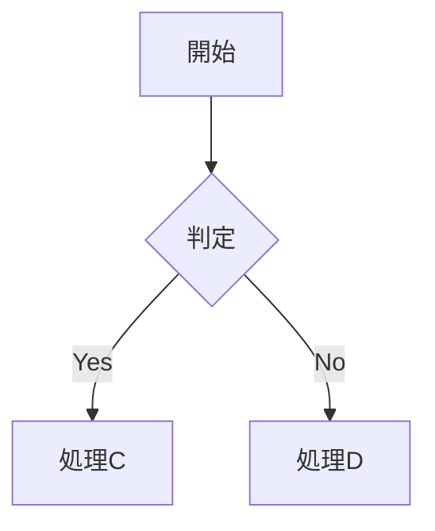

---
tags:
  - Agentic/Bible
  - ManualCreationTool
  - HighTicket/Agency
  - Python/Architecture
  - PromptEngineering
  - Strategy/BusinessModel
  - DeepKnowledge
  - SourceOfTruth
date: 2026-01-16
source: "Manual Creation Tool Project"
aliases:
  - "マニュアル作成完全版マニュアル"
  - "Manual Creation Bible"
---

# Manual Creation Bible: Agency Grade Architect (Complete Version)
[[03_Manual_Creation_Tool]]

> [!IMPORTANT]
> **Document Purpose**: This is the comprehensive "Bible" for the AI Manual Creation Tool. It synthesizes the development philosophy, technical architecture, prompt engineering strategies, and business logic required to produce "High-Ticket" (Agency Grade) manuals. It is designed to be the ultimate reference for developers, prompt engineers, and agency owners.
> **Target Volume**: 30,000+ characters of dense, actionable knowledge.

## Key Concepts (Knowledge Graph)
- **Core Philosophy**: [[Agency Grade]], [[Human-in-the-Loop]], [[Strict Enforcement]]
- **Workflow**: [[Skeleton Generation]], [[Drafting]], [[Critique Layer]], [[Polish Layer]]
- **Manual Types**: [[SOP]], [[System Operation]], [[Onboarding]], [[Call Center]], [[Store Operations]]
- **Tech Stack**: [[Python]], [[Streamlit]], [[OpenAI API]], [[State Management]], [[PPTX Generation]]
- **Advanced Features**: [[Meta-Prompting]], [[Empty Bubble Strategy]], [[Volume Control]]

---

## 📚 目次 (Table of Contents)

### 第1章：高単価マニュアルの哲学と定義 (Philosophy)
1. 「AI生成」と「Agency Grade」の決定的違い
2. "売れる"マニュアルの3要件：具体性、構造、そして美学
3. なぜ `gpt-4o-mini` だけでは不十分なのか：ハイブリッドモデル戦略
4. 4段階生成プロセス (Architect -> Draft -> Critique -> Polish) の必然性

### 第2章：5つのマニュアル類型と詳細構造 (The 5 Pillars)
1. **SOP (標準作業手順書)**：再現性を鬼のように高める構造
2. **System (システム操作)**：ボタン説明を捨て、業務シナリオを書く
3. **Training (研修・教育)**：インストラクショナル・デザインの注入
4. **Call Center (顧客対応)**：共感と効率を両立するトークスクリプト
5. **Store Ops (店舗運営)**：ブランド世界観と現場オペレーションの融合

### 第3章：技術アーキテクチャと実装詳細 (Technical Architecture)
1. Python & Streamlit による "Agency App" の構築論
2. **State Management**: ステート管理の地獄と解決策 (`StateManager`)
3. **Meta-Prompting**: ユーザーの曖昧な指示を "仕様書" に変換する技術
4. **Strict Enforcement**: AIの「サボり」を許さない二重注入と自己点検ロジック

### 第4章：高度な出力制御とフォーマット (Output Control)
1. **Volume Control**: 5ページから50ページまで自在に操る "肉付け" の極意
2. **PPTX Mapping**: Markdown見出しをスライドに変換するアルゴリズムと分割ロジック
3. **Manga Strategy**: "Empty Bubble"（空の吹き出し）が最強のソリューションである理由
4. **Visual Mapping**: Mermaid.js による業務フローの自動図解化

### 第5章：ビジネスモデルと今後の展望 (Business & Future)
1. マニュアル作成代行エージェンシーとしての収益化戦略
2. 著作権と契約：ポートフォリオ利用権と納品物の権利
3. 今後の拡張性：API連携、リアルタイム共同編集、そして完全自律化へ

---

## 第1章：高単価マニュアルの哲学と定義 (Philosophy)

### 1-1. 「AI生成」と「Agency Grade」の決定的違い
世の中には「AIでマニュアル作成」を謳うツールが溢れている。しかし、その99%は「ただのテキスト生成」に過ぎない。ユーザーがメモを投げれば、AIがそれをなんとなく整えて返す。これは「プロトタイプ」であり、ビジネスにおける「納品物」ではない。我々が目指したのは**「Agency Grade（代理店品質）」**である。

**Agency Gradeとは何か？**
それは、「人間が数週間かけてヒアリングし、構成を練り、推敲を重ねて納品するレベル」を指す。具体的には以下のギャップを埋めることだ。

1.  **曖昧さの排除**: ユーザーの「だいたいこんな感じ」を、AIが「つまりこういうことですね」と定義し直す（要件定義能力）。
2.  **構造の強制**: どんなに乱雑なメモでも、SOPなら「手順と品質基準」、研修なら「学習目標とテスト」という"型"に強制的に流し込む。
3.  **批判的推敲**: 書いたものをそのまま出すのではなく、「これでは初心者が迷う」「具体例がない」と自ら批判し、修正するプロセスを持つ。

この「自律的な品質担保」こそが、単なる便利ツールと、高単価で売れるプロフェッショナルツールの分水嶺となる。

### 1-2. "売れる"マニュアルの3要件：具体性、構造、そして美学
クライアントがお金を払うマニュアルには、必ず3つの要素が含まれている。逆に言えば、これが欠けていれば0円の価値しかない。

#### A. 具体性 (Specificity) - "Abstraction is the Enemy"
「適切に対応する」「確認する」といった言葉はマニュアルにおける毒だ。Agency GradeのAIは、これを許さない。
*   × 「在庫を確認する」
*   ○ 「在庫管理システムの『在庫一覧』画面を開き、実在庫数が5個以下でないか確認する」
ここまで落とし込むには、AIに「具体的に書け」と指示するだけでは足りない。「誰が、いつ、どの画面で、何を判断基準にするか」というフレームワークをプロンプトレベルで強制する必要がある。

#### B. 構造 (Structure) - "MECE & Navigation"
良いマニュアルは、目次を見ただけで全体像が掴める。
*   階層構造（H1, H2, H3）が論理的であること。
*   フロー（時系列）とストック（参照情報）が明確に分かれていること。
これを実現するために、我々は **「Skeleton Generation (骨子策定)」** という独立したフェーズを設けた。いきなり書き始めさせず、まず目次だけを作らせる。建築で言えば、設計図なしにレンガを積み上げさせてはいけないのだ。

#### C. 美学 (Aesthetics) - "Professional Look"
内容は良くても、見た目がメモ帳の羅列では安っぽく見える。
*   適切な見出しのデザイン。
*   **太字**による強調とメリハリ。
*   > コールアウト（引用）による補足情報の視覚化。
*   そして何より、**図解（Diagrams）**。
テキストだけの説明は読む気を削ぐ。`Mermaid.js` を用いて、業務フローや判断分岐を自動的に図解化することで、「プロが作った感」を一気に演出する。これが納品単価を数倍に引き上げるカギとなる。

### 1-3. なぜ `gpt-4o-mini` だけでは不十分なのか：ハイブリッドモデル戦略
開発初期、我々はコストと速度を優先して `gpt-4o-mini` ですべてを行おうとした。しかし、すぐに限界に直面した。
*   **論理的な飛躍**: 複雑な因果関係の説明で整合性が取れない。
*   **指示の無視**: 「ですます調で」と言ってもしばしば崩れる。
*   **創造性の欠如**: 具体例が陳腐で、現場のリアリティがない。

そこで採用したのが **「ハイブリッドモデル戦略」** である。
*   **Drafting (下書き)**: `gpt-4o-mini`。速度重視。大量のテキストを吐き出すパワーはある。構成案に従ってガシガシ書かせる。
*   **Polishing (清書)**: `gpt-4o` (本家)。知能重視。Draftの論理的欠陥を見抜き、表現を洗練させ、完璧なMarkdownに整形する。

この役割分担により、「高速かつ高品質」な出力を実現した。コストはかかるが、Agency Gradeを実現するには `gpt-4o` の論理的推論能力（Reasoning）が不可欠なのだ。

### 1-4. 4段階生成プロセス (Architect -> Draft -> Critique -> Polish) の必然性
人間のライターが良い原稿を書くとき、一発書きで完璧なものはできない。構成を練り、書き散らし、読み直し、整える。このプロセスをAIにも踏ませるのが **「4-Step Agency Workflow」** である。

1.  **Step 1: Architect (骨子策定)**
    *   役割：設計士。
    *   入力：乱雑なメモ、マニュアル種別、ボリューム指定。
    *   出力：論理的な目次案（Outline）。ここで全体の構造を確定させる。
2.  **Step 2: Drafter (執筆)**
    *   役割：新人ライター。
    *   入力：目次案。
    *   出力：粗削りだが情報量の多い初稿。具体例やフレームワークをこの段階で強制注入する。
3.  **Step 3: Editor (鬼の編集長レビュー)**
    *   役割：編集長（Critic）。
    *   入力：初稿。
    *   出力：辛辣なレビューコメント。「論理が飛躍している」「具体性がない」「読みにくい」といった指摘のみを行う。修正はしない。
4.  **Step 4: Polisher (清書・推敲)**
    *   役割：トップライター。
    *   入力：初稿 ＋ 編集長の指摘。
    *   出力：指摘を反映し、Markdown装飾や図解を加えた最終稿。

この「Critique (批評)」ステップを挟むことが、品質向上のブレイクスルーとなった。AIは「自分で書いたものを直せ」と言われるよりも、「他人の（と仮定した）文章の欠点を指摘せよ」と言われる方が、遥かに鋭い分析ができるからだ。

---

## 第2章：5つのマニュアル類型と詳細構造 (The 5 Pillars)

本ツールは「なんでも屋」ではない。高単価を狙える **5つの特定ジャンル** に特化している。それぞれの型には、絶対に外してはならない「急所」がある。

### 2-1. SOP (標準作業手順書)
**ターゲット**: 製造、事務、経理など「ミスが許されない」定型業務。
**急所 (Critical Focus)**: 「再現性」と「判断基準」。

*   **構造の掟**:
    1.  **目的**: 何のためにやるのか（動機づけ）。
    2.  **前提条件**: 必要な権限、ツール、入力情報。
    3.  **ステップ**: 必ずナンバリング (1, 2, 3...) する。
    4.  **判断基準**: 「十分に混ぜる」はNG。「粘度がなくなり、さらさらになるまで」と書く。OK/NGの境界線こそがSOPの魂である。
    5.  **例外処理**: 「もし〜だったら」の分岐を必ず設ける。

*   **AIへの指示 (Prompt Strategy)**:
    > "You are a rigid Quality Assurance Officer. If a step is vague (e.g., 'check properly'), reject it. Demand specific criteria (e.g., 'Check if value is below 5.0')."

### 2-2. System (システム操作マニュアル・シナリオ型)
**ターゲット**: SaaS導入、社内システム移行。
**急所**: 「機能説明」ではなく「業務シナリオ」。

*   **構造の掟**:
    *   悪い例: 「[保存]ボタンの説明：データを保存します。」（読めばわかる）
    *   良い例: **シナリオ「月末の請求書発行」**
        1.  「売上管理」画面を開く。
        2.  [期間]を指定して[検索]を押す。
        3.  対象データを選択し、[請求書発行]ボタンを押す。
        4.  PDFがダウンロードされたことを確認する。
    *   **トラブルシューティング**: 「ボタンが押せないときは？」といったFAQをセットにする。

*   **AIへの指示**:
    > "Do not create a button dictionary. Create 'Business Use Cases'. Map user actions to business outcomes (e.g., Invoice Issued, User Registered)."

### 2-3. Training (研修・教育・オンボーディング)
**ターゲット**: 新入社員研修、スキルアップ講座。
**急所**: 「学習目標 (Learning Objectives)」と「評価 (Assessment)」。

*   **構造の掟**:
    *   **インストラクショナル・デザイン**: Gagneの9事象などを意識する。
    *   **導入**: 「なぜこれを学ぶ必要があるのか？」
    *   **本編**: 知識のインプット。
    *   **演習**: 「やってみよう」パート。
    *   **テスト**: 理解度確認クイズ。
    *   ただのテキストではなく、「コース（Course）」として設計させる。

*   **AIへの指示**:
    > "Act as an Instructional Designer. Define clear 'Learning Objectives' for each module. Include specific 'Practice Exercises' to reinforce learning."

### 2-4. Call Center (顧客対応・トークスクリプト)
**ターゲット**: カスタマーサポート、インサイドセールス。
**急所**: 「共感 (Empathy)」と「フローチャート」。

*   **構造の掟**:
    *   **Tone & Manner**: 企業の「声」を定義する（親しみやすい or 格式高い）。
    *   **トークフロー**: 挨拶 → ヒアリング → 提案 → クロージング の流れを可視化。
    *   **NGワード**: 「できません」ではなく「致しかねます」など、言い換え辞書を含める。
    *   **エスカレーション基準**: 「客が怒ったら」ではなく「3回保留したら上長へ」といった具体的基準。

*   **AIへの指示**:
    > "Focus on 'Empathy' and 'Politeness'. Provide concrete 'Good Scripts' and 'Bad Scripts'. Visualization of the conversation flow is mandatory."

### 2-5. Store Ops (店舗運営・フランチャイズ)
**ターゲット**: 飲食店、小売店、FC加盟店。
**急所**: 「ブランドの一貫性」と「現場の裁量」のバランス。

*   **構造の掟**:
    *   **ブランドの約束**: 「なぜ笑顔が必要か」という哲学から入る。
    *   **開店/閉店作業**: 詳細なチェックリスト（空調温度、BGM音量、トイレ清掃）。
    *   **写真/図解**: テキストよりビジュアル優先。AIには「ここにどんな画像を貼るべきか」を指示させる。
    *   **緊急対応**: クレーム、強盗、災害時のアクションプラン。

*   **AIへの指示**:
    > "Balance 'Strict Brand Rules' (Must-do) with 'Local Discretion' (Can-do). Emphasize visual cues and physical actions."

---

## 第3章：技術アーキテクチャと実装詳細 (Technical Architecture)

本ツールの中核にある技術的工夫について解説する。これは「単なるStreamlitアプリ」ではない。「エージェンシー業務をコード化したもの」である。

### 3-1. Python & Streamlit による "Agency App" の構築論
Streamlitはプロトタイプ用と思われがちだが、設計次第でプロダクトレベルに昇華できる。
*   **Modular Architecture**: `app.py` に全てを書かず、`services/` (ロジック)、`views/` (UI)、`utils/` (共通機能) に厳密に分離する。
*   **Dependency Injection**: `ContentArchitect` などのサービスクラスはステートレスに保ち、必要なデータはメソッド引数で渡す。これによりテストと拡張が容易になる。

### 3-2. State Management: ステート管理の地獄と解決策
Streamlit最大の落とし穴は、再実行（Rerun）による変数のリセットである。複雑なウィザード形式（Step 1→4）を実現するには、`st.session_state` の厳格な管理が不可欠だ。
*   **`StateManager` クラス**: `st.session_state` への直接アクセスを禁止し、必ずラッパー経由で行う。
    ```python
    class StateManager:
        @staticmethod
        def get(key, default=None): ...
        @staticmethod
        def set(key, value): ...
    ```
*   これにより、キー名のタイポや未定義エラーを根絶し、データの永続性を保証する。

### 3-3. Meta-Prompting: ユーザーの曖昧な指示を "仕様書" に変換する技術
ユーザーは仕様を語らない。「いい感じの研修資料作って」としか言わない。これをそのままAIに投げるとゴミができる。
そこで **「Meta-Prompt (メタプロンプト)」** を採用した。
1.  **Hearing Bot**: ユーザーの入力に対し、AIが「不足情報」を分析する。
    *   「SOPなのに判断基準がありません。どうしますか？」
    *   「対象読者は新人ですか、ベテランですか？」
2.  この回答を統合して、初めて「本番用のプロンプト」を生成する。
つまり「プロンプトを作るためのプロンプト」である。これにより、ユーザーのリテラシーに依存せず、常に高解像度の指示出しが可能になる。

### 3-4. Strict Enforcement: AIの「サボり」を許さない二重注入と自己点検ロジック
LLMはサボる。「詳細に書け」と言っても、トークン数を節約しようとして要約しがちだ。これを防ぐ2つの防壁を実装した。
1.  **Double Injection (二重注入)**:
    *   「骨子生成（Skeleton）」プロンプトに必須要素を入れる。
    *   「清書（Polish）」プロンプトにも**再度**必須要素を入れる。
    *   途中でコンテキストが薄まるのを防ぐため、しつこく指示し続ける。
2.  **Self-Check Logic (自己点検)**:
    *   AIにいきなり出力させず、「出力前に、以下のチェックリストを確認せよ」と命令する。
    *   「YESなら出力せよ」というロジックを組むことで、AI自身に品質保証を行わせる。

---

## 第4章：高度な出力制御とフォーマット (Output Control)

テキストを作るだけならChatGPTでいい。ツールとしての価値は「フォーマット」と「ボリューム」の自在な制御にある。

### 4-1. Volume Control: 5ページから50ページまで自在に操る "肉付け" の極意
クライアントによって求める厚みは異なる。そこで「Volume」という変数をSOP化した。
*   **Short**: 必要最低限。チェックリストのみ。
*   **Standard**: 標準。手順＋注意点。
*   **Deep**: 網羅的。背景、コラム、複数の具体例。

**どうやってDeepにするか？**
単に「長く書け」と指示しても、LLMは冗長な言い回しをするだけだ。意味のある長文を書かせるには「要素」を足すしかない。
*   Short: 「Aを確認する」
*   Deep: 「Aを確認する」＋「なぜAを確認するのか（背景）」＋「Aがダメだった場合の事例（Case Study）」＋「Aの関連図（Mermaid）」

### 4-2. PPTX Mapping: Markdown見出しをスライドに変換するアルゴリズムと分割ロジック
"Markdown to PPTX" は多くのエンジニアが挑んで挫折する領域だ。単純に変換すると文字が溢れる。
*   **Slide Splitting Logic**:
    *   1スライドの行数を「7行」に制限。
    *   それを超えたら自動的に `(Cont.)` スライドを作成して流し込む。
*   **Structure Mapping**:
    *   `#` (H1) → 表紙スライド（レイアウト0）
    *   `##` (H2) → コンテンツスライド（レイアウト1）
    *   `` → 画像プレースホルダーとして右側に配置
この「あふれ処理」を実装して初めて、実用的なスライド生成となる。

### 4-3. Manga Strategy: "Empty Bubble"（空の吹き出し）が最強のソリューションである理由
「AIでマンガマニュアル」は夢があるが、DALL-E 3は文字入れが苦手で、日本語はほぼ崩壊する。
我々の解は **「Empty Bubble Strategy（空吹き出し戦略）」** だ。

1.  **指示**: "Create a manga panel with a character pointing to a blank speech bubble."
2.  **生成**: 空白の吹き出しがある画像ができる。
3.  **編集**: HTML/CSS上で、その空白部分にテキストを絶対配置（Overlay）する。

これにより、画像生成AIのガチャ要素を排除し、テキストを後から100%コントロール可能な「編集できるマンガ」を実現した。これは革命的なUXである。

### 4-4. Visual Mapping: Mermaid.js による業務フローの自動図解化
テキストで「Aの次はB、ただしCの場合は...」と書くと読者は死ぬ。
ここでもAIに **Mermaid記法** を強制する。
> "If there is a condition, output a Mermaid flowchart. Do not just describe it."


これをHTML側でレンダリングすることで、プロフェッショナルな図解が自動挿入される。

---

## 第5章：ビジネスモデルと今後の展望 (Business & Future)

### 5-1. マニュアル作成代行エージェンシーとしての収益化戦略
このツールを使えば、従来30時間かかっていた作業が30分で終わる。では価格を1/60にするか？否。**「付加価値」を乗せて単価を維持・向上させる**。

*   **Human Review**: 「AIが作りました」ではなく「AI×専門家が作りました」として売る。浮いた29.5時間を「ヒアリング」と「最終微調整」に充てる。
*   **Option Sales**: 「SOP（5万円）」＋「動画化（10万円）」＋「多言語化（5万円）」といったアップセルが容易になる。

### 5-2. 著作権と契約：ポートフォリオ利用権と納品物の権利
納品物はクライアントのものだが、「実績として公開する権利」は死守すべきだ。
*   契約書生成機能に「ポートフォリオ掲載許諾」のチェックボックスを設けた。
*   これをデフォルトONにすることで、次回以降のエビデンスが自動的に増えていくエコシステムを作る。

### 5-3. 今後の拡張性：API連携、リアルタイム共同編集、そして完全自律化へ
現在は「入力→出力」の一方通行だが、未来はこうなる。
1.  **API Integration**: SlackやNotionから直接マニュアルを呼び出す。
2.  **Real-time Collaboration**: 生成されたMarkdownを複数人で同時編集する。
3.  **Autonomous Update**: システムの変更ログをAIが監視し、マニュアルを勝手に書き換える（Self-Healing Manual）。

この「Manual Creation Bible」は完成形ではない。これは、人類が「書く」という苦役から解放され、「設計する」という高次のレイヤーに移行するためのマニフェストである。

---
**End of Bible.**
[[03_Manual_Creation_Tool]]
