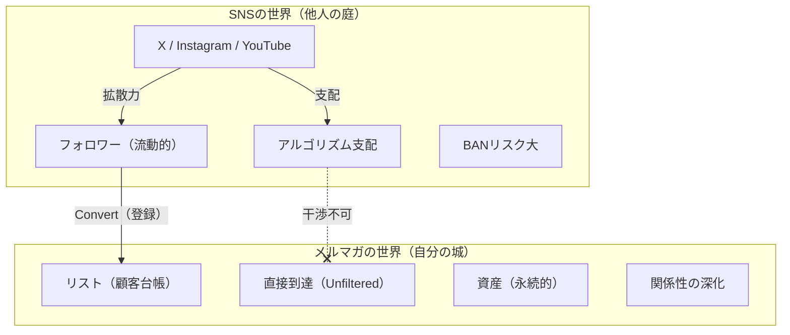

# Vol.51 メルマガ運営のすすめ〜なぜ“リスト”を制する者が副業を制するのか〜【深層対話】

[[00_知識マップ|⬅️ 00：知識マップへ戻る]]

## 📖 まえがき：ビジネス宇宙の「ダークマター」に触れる

SNSのフォロワーが1万人いても、明日のご飯が食べられない人がいる。
逆に、フォロワーなんて数百人しかいないのに、静かに、誰にも気づかれずに月収100万、300万と稼ぎ続ける人がいる。

この決定的な違いは何か？

答えはたった一つ。**「メルマガ（リスト）を持っているか否か」**である。

「メルマガ？ 古くない？」
そう思った瞬間、あなたはビジネスの「真理」から遠ざかったことになる。
LINE、Discord、Slack……形は変われど、**「クローズドな空間で、特定の個人に、直接言葉を届ける」**という仕組みの頂点に君臨し続けるのがメールマガジンだ。

なぜ、メルマガ運営者は副業で無双するのか？
なぜ、SNSだけで消耗する人は、いつまでも労働地獄から抜け出せないのか？

本バイブルでは、表層的な「開封率」や「クリック率」の話はしない。
もっと根源的な、**「他者の脳内に、あなた専用の部屋（Inbox）を作る」**という、極めて心理的かつ軍事的な戦略について語り尽くそう。

これは「メルマガのやり方」ではない。
**「あなたの影響力を、永続的な資産（金脈）に変える錬金術」**の奥義書である。

---

## 👥 参加エキスパート（深層対話メンバー）

本セッションは、以下の4名のスペシャリストによる「深層対話（Deep Dialogue）」形式で進行する。

1.  **💌 Neuro-Copywriter (言葉の魔術師)**
    *   **役割**: 「読ませる」ではなく「インストールする」ライティング技術の解明。
    *   **視点**: なぜ1通のメールが、読者の人生を変え、財布の紐を解くのか？ 脳科学的アプローチと言語支配。

2.  **⚙️ Funnel Architect (仕組み化の神)**
    *   **役割**: 人の感情を計算し尽くした「自動化設計（ステップメール）」の構築。
    *   **視点**: 寝ている間に商品が売れるのは奇跡ではない。「必然」の設計図を描く建築家。

3.  **🕍 Cult Brand Manager (コミュニティの支配者)**
    *   **役割**: リストを「顧客」ではなく「信者（ファン）」に変える熱狂の作り方。
    *   **視点**: クローズドな空間だからこそ生まれる「共犯関係」と「宗教性」の正体。

4.  **📉 Behavioral Economist (行動の科学者)**
    *   **役割**: ナッジ理論を用いた「行動変容」のデザイン。
    *   **視点**: 人は論理では動かない。どのボタンを押せば「登録」し「購入」するのか、非合理な人間心理をハックする。

5.  **🦄 Unico (PM・統括ファシリテーター)**
    *   **役割**: 全ての知見を統合し、読者が「今すぐメルマガを始めないと危険だ」と確信するレベルまで昇華させる。

---

## 📑 目次（Contents）

1.  **第1章：【資産の正義】「顧客リスト」こそが、人類史上最強の資産である**
    *   江戸時代の商人が火事場から持ち出した「大福帳」の教え
    *   SNSのフォロワーは「他人（プラットフォーム）の庭」、リストは「自分の城」
2.  **第2章：【欠落した能力】メルマガをやらない人が一生得られない「3つの筋肉」**
    *   プッシュ型マッスル：待つのではなく「ねじ込む」力
    *   長文耐久マッスル：140文字で退化する思考力への警鐘
    *   クローズド・インティマシー：公衆の面前ではできない「密室の会話」
3.  **第3章：【In-boxの心理学】最もプライベートな「聖域」への侵入許可**
    *   スマホの通知欄は「現代の戦場」である
    *   「迷惑メール」になるか「ラブレター」になるかの境界線
4.  **第4章：【自動化の魔術】ステップメール — 時間と空間を超えるセールスマン**
    *   7日間で「他人」を「親友」に変える教育シナリオの鉄則
    *   売り込み（セールス）を「救済（オファー）」に変える文脈設計
5.  **第5章：【具体的戦略】ゼロから始める「リストビルディング」完全ロードマップ**
    *   最初の10リストを集めるための「無料プレゼント（Lead Magnet）」の作り方
    *   LP（ランディングページ）は「魂の叫び」を書け
6.  **第6章：【マネタイズの真髄】なぜメルマガなら30万円の商品が飛ぶように売れるのか**
    *   「信頼残高」の可視化と引き出し方
    *   ローンチ（Product Launch）の縮小版を回し続ける永久機関
7.  **第7章：【コミュニティ運営】「顧客」を「同志」に変える秘密結社の作り方**
    *   一方通行（メルマガ）から双方向（サロン）への進化論
    *   熱狂を生む「儀式（リチュアル）」のデザイン
8.  **第8章：【未来予測】ニュースレター経済圏（Substack）の勃興**
    *   「書くこと」が再び最強の通貨になる理由
    *   有料メルマガという「知識のサブスク」モデル
9.  **最終章（第9章）：AI時代における「Human Letter」の逆襲**

---

## Keywords & Tags
#EmailMarketing #DRM #ListBuilding #FunnelMarketing #StepMail #Copywriting #FanCommunity #LTV #Monetization #SideBusiness #AssetStrategy #PsychologyOfSales #DeepDialogue #Vol51 #00

---

## 第1章：【資産の正義】「顧客リスト」こそが、人類史上最強の資産である

### 🗣️ 深層対話パート 1：大福帳の教えとプラットフォーム依存の恐怖

**Unico**:
記念すべき第51弾は「メルマガ」です。
SNS全盛の今、「メルマガは古い」という声をよく聞きますが、実際はどうなのでしょうか？

**Funnel Architect (仕組み)**:
「古い」と言う人は、ビジネスの構造（アーキテクチャ）が見えていませんね。
古くからあるには理由があります。**「リストマーケティング（DRM）」**こそが、商売の原始にして頂点だからです。
江戸時代の商人は、店が火事になったら何を持って逃げたか知っていますか？

**Cult Brand Manager (信者)**:
**「大福帳（顧客台帳）」**ですよね。
商品は燃えても仕入れればいい。店は燃えても建て直せばいい。
でも、「誰が何を買ってくれたか」「誰が常連か」という**顧客リスト**だけは、燃えたら二度と取り戻せない。
逆に言えば、リストさえあれば、翌日から「火事でお店がなくなりましたが、仮店舗で営業します」と手紙を出して、商売を再開できる。

**Unico**:
現代で言えば、「XのアカウントがBANされた」「YouTubeチャンネルが削除された」という状況ですね。
リストを持っていない人は、その瞬間に死にますか？

**Behavioral Economist (行動)**:
死にます。即死です。
SNSのフォロワーは、あなたの資産ではありません。**「プラットフォーム（X社やGoogle社）からの借家権」**に過ぎない。
彼らの機嫌一つ、アルゴリズムの変更一つで、あなたの声は誰にも届かなくなる。
これを**「プラットフォーム・リスク」**と呼びます。
多くの副業初心者は、このリスクにあまりにも無頓着です。「フォロワー数＝資産」だと勘違いしている。

**Neuro-Copywriter (言葉)**:
SNSは「広場」で大声で演説しているようなものです。
人は集まりますが、いつ立ち去るか分からないし、隣でもっと大きな声（バズ）があればそちらに流れる。
一方、メルマガは**「相手の家のポスト」**、あるいは**「寝室」**に直接手紙を入れる行為です。
この「距離感」の決定的な違い。
副業で成果を出せる人は、広場（SNS）で集めた人を、いかに早く自分の部屋（メルマガ・LINE）に連れ込むか、その**「導線（Funnel）」**だけに命をかけています。

---

### 📊 図解：SNS vs メルマガの資産性比較

**Funnel Architect (仕組み)**:
この図を見てください。
SNSは「入り口」としては優秀ですが、「出口（売上）」を作る場所ではありません。
**「SNSで集客し、メルマガで教育し、販売する」**。
この黄金ルート（ゴールデン・パス）を構築できた人だけが、SNSのアルゴリズム変動に怯えることなく、安定して月100万、1000万と稼ぎ続けることができるのです。

**Unico**:
つまり、メルマガをやっていない人は、「穴の空いたバケツ」に一生懸命水を汲んでいるようなものですね。

**Behavioral Economist (行動)**:
その通りです。これを**「ザル集客」**と呼びます。
どんなにバズっても、リストに残らなければ、その熱狂は一瞬で冷める。
一発屋で終わるインフルエンサーと、長く生き残る実業家の違いは、ここに全て集約されます。

---

### 📜 歴史から学ぶ：DRMの系譜 — カタログ通販からメルマガへ

**Cult Brand Manager (信者)**:
少し歴史の話をしましょう。
メルマガの起源は、インターネット以前の**「ダイレクトメール（DM）」**や**「カタログ通販」**にあります。
アメリカの伝説的なコピーライター、クロード・ホプキンスやデビッド・オグルヴィたちは、一度も会ったことのない顧客に、手紙（セールスレター）一本で高額商品を売りさばいていました。

**Funnel Architect (仕組み)**:
彼らの「リスト管理」は執念深いものでした。
「一度購入した客」には、さらに別の商品のカタログを送る。
反応がない客には、「お久しぶりです」と割引券を送る。
この泥臭いオペレーションを、現代では**「MA（マーケティング・オートメーション）」**ツールが秒速で行っているだけです。

**Unico**:
本質は変わっていないんですね。
「郵便ポスト」が「受信トレイ」に変わっただけ。

**Behavioral Economist (行動)**:
しかし、コストが劇的に下がりました。
紙のDMを一通送るのに100円かかるとしたら、1万人に送れば100万円です。
でもメルマガなら、1万人送っても数千円（サーバー代）です。
**「限界費用ゼロ」**で、無限にアプローチできる。
この「レバレッジ」を使わない手はありません。
資本力のない個人が、大企業と戦える唯一の武器。それがメルマガなのです。

---

## 第2章：【欠落した能力】メルマガをやらない人が一生得られない「3つの筋肉」

### 🗣️ 深層対話パート 2：受け身のSNS、攻めのメルマガ

**Unico**:
では少し角度を変えて、「能力開発」の視点で話しましょう。
「メルマガをやっている人」にあって、「やっていない人」に決定的に欠けている能力とは何でしょうか？

**Neuro-Copywriter (言葉)**:
まず**「プッシュ型マッスル（記述力）」**ですね。
ブログやYouTubeは「プル型（Pull）」です。相手が見に来るのを待つしかない。
しかしメルマガは「プッシュ型（Push）」です。**「こっちから相手のスマホを鳴らす」**ことができる。

これは恐ろしい権力ですが、同時に責任も伴います。
「つまらない通知」を送れば、即「解除（Block）」という死刑宣告を受ける。
この緊張感の中で、「今、この瞬間に、この件名で送るべきか？」を常に考え続ける。
この**「攻めの思考」**の違いです。

**Cult Brand Manager (信者)**:
SNSだけの人は「待つ」ことに慣れすぎています。
「バズるのを待つ」「おすすめに乗るのを待つ」。
これではビジネスマンとしての**「自律神経」**が育ちません。
自分から仕掛けて、空気を変えて、商品を売る。この「場をコントロールする力」が養われないのです。

### 🧠 欠落能力その2：長文耐久マッスル

**Behavioral Economist (行動)**:
次に深刻なのが**「長文耐久力（Long-form Stamina）」**の低下です。
X（Twitter）やTikTokに毒された脳は、情報の断片しか処理できなくなっています。
「3行で頼む」「結論だけ教えて」。
しかし、人を深く感動させたり、高額商品を販売するには、**「物語（ナラティブ）」**が必要です。
背景、葛藤、解決、未来……これらを語るには、どうしても数千文字のテキストが必要になる。

**Neuro-Copywriter (言葉)**:
メルマガ運営者は、毎日3000文字、5000文字というテキストを読者に「読ませ切る」訓練をしています。
飽きさせないリズム、次が読みたくなるブリッジ、没入させる描写。
この**「長尺のコンテンツを完読させる筆力」**があるから、いざ電子書籍を書いても、LP（ランディングページ）を書いても、圧倒的に強い。
SNS育ちの人は、ここが弱い。すぐに離脱される薄っぺらい文章しか書けなくなっている。

### 🔒 欠落能力その3：クローズド・インティマシー（密室の親密さ）

**Cult Brand Manager (信者)**:
これが一番大きいかもしれません。**「密室での口説き」**を知らない。
SNSは「公衆の面前」です。だから「綺麗事」しか言えない。
「みんなのために」「世界平和」。
でも、人は「本音」に惹かれます。
「本当は、金が欲しいんだろ？」「あいつのこと、ムカついてるんだろ？」
メルマガという**「クローズドな密室」**だからこそ、出せる**「毒」**や**「闇」**がある。

**Unico**:
ああ、分かります。メルマガ限定の「裏話」って、すごくワクワクしますよね。

**Cult Brand Manager (信者)**:
そう。この**「ここだけの話（Disclosure）」**が、強烈な**「共犯関係」**を生むのです。
「この人は、世間ではいい人ぶってるけど、私にだけは本音を話してくれる」。
この感覚を植え付けられた読者は、もうその発信者から離れられません。**「信者化」**のメカニズムです。

SNSしかやっていない人は、常に「いい子ちゃん」でいなければならない。
だから熱狂的なファンがつかない。
**「誰にも嫌われない代わりに、誰からも愛されない」**。このジレンマに陥ります。

**Funnel Architect (仕組み)**:
副業で大きく稼ぐ（月100万以上）には、100人の「なんとなくのファン」より、1人の「熱狂的な信者」の方が価値があります。
その**「濃い関係性」**を醸成（nurture）する装置として、メルマガ以上のものはありません。

---

### 🏋️ 能力開発ワークショップ：プッシュ型思考の獲得

**Funnel Architect (仕組み)**:
ここで、メルマガ脳（プッシュ型）を鍛えるワークを行いましょう。
あなたはSNSで「良い記事」を書きました。
SNS脳の人は「投稿して終わり」です。
メルマガ脳の人は、どうしますか？

**Unico**:
メルマガで「記事更新のお知らせ」を送る…だけでは、弱い気がします。

**Neuro-Copywriter (言葉)**:
その通り。ただの更新通知は「ゴミ」です。
メルマガ脳の人は、その記事を**「再編集（Remix）」**して届けます。

> **【件名】**
> × ブログ更新しました：失敗しない副業の選び方
> ○ 【衝撃】私が300万溶かして気づいた、詐欺副業の共通点について（ブログでは書けない裏話あり）

**Unico**:
うわ、読みたくなりますね。「裏話あり」がズルい。

**Cult Brand Manager (信者)**:
そう。メルマガ読者にだけ**「エコひいき」**をするのです。
「ブログには綺麗事を書きましたが、あなたには本当のことを言います」というスタンス。
この**「特別扱い」**を呼吸するようにできるか。
これがプッシュ型思考の正体です。
相手の懐に飛び込むとき、必ず「手土産（メリット）」を持っていく。
だから、嫌われないのです。

---

## 第3章：【In-boxの心理学】最もプライベートな「聖域」への侵入許可

### 🗣️ 深層対話パート 3：LINE vs メール

**Unico**:
ここでよく出る質問ですが、「今はメルマガよりLINE公式アカウントの方がいいのでは？」という点について。
到達率も開封率もLINEの方が上ですよね？

**Behavioral Economist (行動)**:
短期的にはYESです。しかし、中長期的には**「メール」という媒体の特殊性**を見逃してはいけません。
LINEは「フロー（会話）」のツールです。ポンポン進む。
メールは「ストック（手紙）」のツールです。じっくり読む。

高額な商品（コンサル、講座、高機能ツール）を売る場合、相手に**「熟考モード（System 2）」**に入ってもらう必要があります。
LINEのチャット画面のような狭いUIで、長文の哲学的な話をされても、頭に入ってきません。
「落ち着いて、コーヒーでも飲みながら、PCの大画面で読んでほしい」。
この**「読む態勢」**を作れるのが、未だにメールなのです。

**Neuro-Copywriter (言葉)**:
それに、Inbox（受信トレイ）という場所の意味合いです。
そこには、Amazonからの請求書、上司からの業務連絡、親からの手紙も届きます。
つまり、**「生活や人生に直結する重要な情報」**が入る場所なのです。
LINEは「遊び」や「雑談」が多い。
メールのInboxにあなたの名前が並ぶということは、**「彼の人生の重要事項リスト」**に割り込むことを意味します。

**Unico**:
なるほど。「私信」としての重みが違うと。

**Neuro-Copywriter (言葉)**:
そうです。
件名：『【重要】あなたの人生を変える提案があります』
これがLINEで来たら「うざっ」でブロックです。
でもメールなら、もし信頼関係ができていれば、「何だろう？」と開く。
この**「重厚感」**をあえて演出するために、トップマーケターたちは今あえてLINEからメルマガに回帰しています。

### 📧 「迷惑メール」と「ラブレター」の境界線

**Cult Brand Manager (信者)**:
初心者が一番恐れるのが「迷惑メールだと思われないか？」という恐怖心です。
だから「週1回」とか遠慮がちに送る。これは最悪です。

**Funnel Architect (仕組み)**:
逆です。**「毎日」**送るんです。
ザイオンス効果（単純接触効果）をナメてはいけません。
週1回の恋人より、毎日顔を合わせる同僚の方が、親密度は上がる。
「迷惑だと思われる」のは、内容がつまらないからです。**「売り込み（Sales）」**ばかりしているからです。

**Neuro-Copywriter (言葉)**:
内容が**「GIVE（有益な情報、面白い話、勇気づけ）」**であれば、それは毎日届く「プレゼント」になります。
朝起きて、メールボックスを開き、あなたのメルマガを読むのが「日課（ルーティン）」になる。
ここまで行けば勝ちです。
「今日は何かな？」と待たれている状態。
そこまで自分を持っていけるかどうか。メルマガ運営とは、自分の**「エンターテイメント能力」**への挑戦でもあります。

---

### 🧪 件名エンジニアリング：開封率を支配する4つの型

**Neuro-Copywriter (言葉)**:
メルマガで最も重要なのは「中身」ではありません。**「件名（Subject）」**です。
開かれなければ、中身は存在しないのと同じだからです。
私は件名を決めるとき、常に以下の**「4つの型（4C）」**を使っています。

1.  **Curiosity（好奇心）**
    *   『なぜ、あの人は働かずに年収3000万なのか？』
    *   『【閲覧注意】削除覚悟で書きます』
2.  **Crisis（危機感・損失回避）**
    *   『【明日まで】このメールを読まないでください』
    *   『あなたの資産が半分になる日が来ました』
3.  **Controversy（論争・逆説）**
    *   『「努力は報われる」は嘘です』
    *   『貯金をする人ほど貧乏になる理由』
4.  **Close（親近感・私信）**
    *   『Unicoさん、ちょっと相談があります（名前差し込み）』
    *   『昨日の件、大丈夫ですか？』

**Behavioral Economist (行動)**:
特に4番目の「Close」は強力です。
あたかも「友人からのメール」のように偽装（Camouflage）する。
開封率は劇的に上がりますが、中身が伴わないと「釣り」だと思われて信頼残高が減ります。
劇薬ですが、ここぞという時に使うべきテクニックですね。

**Unico**:
この4つを使い分けるだけで、単調なメルマガ配信が「エンタメ」に変わりますね。
「今日はどのボールが飛んでくるんだろう？」と読者をワクワクさせる。
これこそが、Inboxを支配するということです。

---

## 第4章：【自動化の魔術】ステップメール — 時間と空間を超えるセールスマン

### 🗣️ 深層対話パート 4：最強の自動販売機

**Funnel Architect (仕組み)**:
ここからが私の独壇場です。
メルマガの真骨頂は、**「時間を歪めることができる」**点にあります。
SNSは「現在（NOW）」しか共有できません。
しかしステップメールを使えば、今日登録した人には「1通目」を、1週間前に登録した人には「7通目」を、**登録したタイミングに合わせて**自動配信できます。
これが意味することは分かりますか？

**Unico**:
常に「一番熱いタイミング」で、順序立てて話を伝えられる、ということですね。

**Funnel Architect (仕組み)**:
そうです。
いきなり「結婚してください（商品を買ってください）」と言っても断られます。
恋愛と同じで、手順（Step）が必要です。

1.  **出会い**: 無料プレゼントで興味を引く
2.  **自己開示**: 私は何者で、どんな信念があるか
3.  **共感**: あなたの悩み、痛いほど分かります
4.  **教育**: その悩みは、実は〇〇が原因なんですよ（パラダイムシフト）
5.  **オファー**: そして、それを解決する唯一の方法がこれです

このシナリオを一度組んでしまえば、あなたが寝ていようが、旅行に行っていようが、システムが勝手に「口説き」を行ってくれる。
これが**「自動化（Automation）」**の正体です。
労働収益から脱却できない人は、毎回毎回、新しい客に同じ説明を繰り返している。
メルマガ運営者は、その説明を「仕組み」に代行させているのです。

### 💊 「売り込み」を「救済」に変える文脈設計

**Neuro-Copywriter (言葉)**:
ここで重要なのが、ステップメールは「売り込み装置」ではないということです。
多くの人は勘違いして、毎日「買ってください」とメールを送る。それはスパムです。
私が書くステップメールは、**「教育（Education）」**です。

*   「なぜ、あなたは今まで痩せられなかったのか？」
*   「なぜ、英語が話せなかったのか？」

読者が抱えている**「間違った常識（思い込み）」**を破壊し、新しい視点を与える。
これを繰り返すと、読者はどうなると思いますか？

**Behavioral Economist (行動)**:
**「認知的不協和」**の解消を求めて、あなたの解決策にすがりつきたくなります。
「そうだったのか！ じゃあどうすればいいの？」と前のめりになる。
そこで初めて商品を提示する。
すると、それは「売り込み」ではなく、**「救済（待ってました）」**になるのです。

**Unico**:
感謝されながら高額商品が売れる。この矛盾する現象は、ステップメールによる「十分な教育期間」があって初めて成立するんですね。

---

### 🗓️ 実践シナリオ：7日間で信者化するステップメール構成案

**Unico**:
具体的に、どんな流れでメールを送ればいいのでしょうか？
黄金の「型」があれば教えてください。

**Funnel Architect (仕組み)**:
私が推奨する「7日間教育プログラム（The 7-Day Nurture Sequence）」を公開しましょう。
これは、あらゆるジャンル（稼ぐ系、ダイエット、スピリチュアル）に応用可能です。

| 日数 | テーマ | 目的（心理的アプローチ） |
| :--- | :--- | :--- |
| **Day 1** | **御礼とプレゼント** | 【信頼】約束を守る。GIVEで圧倒する。「この人は他と違う」と思わせる。 |
| **Day 2** | **自己開示（物語）** | 【共感】V字回復ストーリー。「私も昔はダメだった」と弱みを見せる。 |
| **Day 3** | **敵の定義** | 【共有】共通の敵を作る。「あなたが悪いのではなく、〇〇が悪いのです」。 |
| **Day 4** | **新世界の提示** | 【希望】「もし〇〇ができたら、どんな明日が待っていますか？」未来を見せる。 |
| **Day 5** | **常識の破壊** | 【権威】業界の嘘を暴く。「みんなこう言ってますが、実は間違いです」。 |
| **Day 6** | **予告（ティーザー）** | 【期待】「明日、重大な発表があります」。ザイガニック効果で眠れなくさせる。 |
| **Day 7** | **オファー（販売）** | 【解放】「お待たせしました。これが解決策です」。限定性を添えて。 |

**Neuro-Copywriter (言葉)**:
Day 3の「敵の定義」がポイントです。
ダイエットなら「意志の弱さ」ではなく「遺伝子」や「メーカーの陰謀」を敵にする。
すると、読者は「私は悪くなかったんだ」と救われます。
この**「免罪符（Exoneration）」**を与えることで、あなたの言葉は彼らにとっての「福音」に変わるのです。

---

## 第5章：【具体的戦略】ゼロから始める「リストビルディング」完全ロードマップ

### 🗣️ 深層対話パート 5：最初の10リストを集める戦い

**Cult Brand Manager (信者)**:
理論は分かりました。では、具体的にどう集めるか。
初心者はここで挫折します。「誰も登録してくれない」と。

**Behavioral Economist (行動)**:
人間は合理的です。「メールアドレス」という個人情報を渡すには、それ相応の**「対価（Incentive）」**が必要です。
「メルマガ始めました、登録してね」では誰も登録しません。メリットがないからです。
必要なのは、**「Lead Magnet（強力な磁石）」**です。
つまり、**「無料プレゼント」**です。

**Funnel Architect (仕組み)**:
このプレゼントの質で、勝負の9割が決まります。
*   ×「副業のコツ教えます」
*   ○「【動画講義】1日30分の作業で月5万稼いだ具体的なマニュアル（全30ページPDF）」
ここまで具体的で、有料級のものでなければなりません。
これを**「Freebie（フリービー）」**と呼びます。

**Unico**:
「えっ、これをタダで出しちゃうの？」と思われるくらいじゃないとダメなんですね。

**Cult Brand Manager (信者)**:
そうです。そこで「返報性の原理」を発動させるんです。
「こんな凄いものをタダでくれたこの人は、一体何者なんだ？」
この**「圧倒的なGIVE」**から始まった関係は、非常に強い信頼で結ばれます。

### 📄 LP（ランディングページ）：魂の叫びを書け

**Neuro-Copywriter (言葉)**:
そして、そのプレゼントを受け取るためのページ（LP）です。
ここには、あなたの**「世界観（Worldview）」**を凝縮させてください。
単に「プレゼントあります」ではなく、
「私はこういう世の中に怒っている」
「こんな人を救いたいと思っている」
という**「理念」**を書く。

機能（メリット）で集まった人は、もっと良い機能があれば去っていきます。
しかし、**理念（想い）**で集まった人は、あなたのファンとして長く残り続けます。
メルマガ登録LPこそ、あなたの**「独立宣言書」**であるべきです。

---

### ✅ 反応率が変わるLPの「鬼のチェックリスト」

**Funnel Architect (仕組み)**:
LP（ランディングページ）を作るとき、初心者は「デザイン」に凝りますが、間違いです。
重要なのは「文字（Copy）」です。
以下の5つの要素が入っているか、公開前に必ずチェックしてください。

1.  **ベネフィット・ヘッドライン**: 読んだ瞬間に「私のことだ！」と思わせる強烈な一行があるか？
2.  **ブレッド（箇条書き）**: プレゼントの中身を魅力的に列挙しているか？
    *   *悪い例*: 「ダイエット動画」
    *   *良い例*: 「なぜ、運動ゼロで代謝が上がるのか？ 科学的根拠に基づいた呼吸法（12分）」
3.  **権威性（Authority）**: 実績、推薦者の声、証拠写真はあるか？
4.  **リスク・リバーサル**: 「無料です」「いつでも解除できます」と明記し、登録の恐怖を消しているか？
5.  **CTA（Call To Action）**: ボタンの色は目立つか？ マイクロコピー（ボタン上の文字）は魅力的か？

**Cult Brand Manager (信者)**:
特に「リスク・リバーサル」は大事です。
「1クリックで解除できます」と書くだけで、登録率は20%上がります。
入り口は広く、出口も広く。
「縛り付けない」という余裕が、逆に人を惹きつけるのです。

---

## 第6章：【マネタイズの真髄】なぜメルマガなら30万円の商品が飛ぶように売れるのか

### 🗣️ 深層対話パート 6：信頼残高とオファーの法則

**Unico**:
最後にマネタイズです。メルマガ読者に対して、何をどう売ればいいのでしょうか？

**Behavioral Economist (行動)**:
基本的に、メルマガ読者はSNSフォロワーの**10倍〜20倍のLTV（顧客生涯価値）**があります。
SNSで500円のnoteしか売れなくても、メルマガなら30万円の講座が売れます。
なぜか？
**「信頼残高（Trust Battery）」**が満タンだからです。

SNSでは、流し読みしかされません。
しかしメルマガでは、毎日あなたの長文を読み、思考に触れ、動画を見ている。
すでに「先生と生徒」「教祖と信者」の関係ができあがっています。
この状態で、**「私の全ての知識を詰め込んだ講座をやります。来たい人はいますか？」**と聞く。
これだけで売れます。
煽る必要も、嘘をつく必要もありません。

**Funnel Architect (仕組み)**:
これを**「ローンチ（Product Launch）」**と呼びますが、巨大な広告費をかけなくても、自分のリスト内だけで小規模なローンチ（ミニ・ローンチ）を繰り返すだけで、個人でも年商1000万〜3000万は余裕で行きます。
必要なリスト数は？ 驚かないでください。
**「300〜500リスト」**あれば十分です。
1万人なんて要らないのです。

**Cult Brand Manager (信者)**:
信者ビジネスの極意ですね。
1000人の「なんとなくの人」より、300人の「熱狂的なファン」がいれば、一生食っていける。
それを実現できる唯一の箱が、メルマガなのです。

---

### 📈 1リスト単価（LTV）を極限まで高める「階段設計」

**Behavioral Economist (行動)**:
さて、300人で年商1000万を達成するための「数字の魔法」をお見せしましょう。
これを**「バリューラダー（価値の階段）」**と呼びます。

1.  **フロントエンド（集客商品）**: 無料、または低価格（500円〜3,000円）。
    *   目的：顧客リストの獲得と、財布の紐を開ける練習。
2.  **ミドルエンド（本命商品）**: 3万円〜5万円の教材・ツール。
    *   目的：利益の確保と、コアなファンの選別。
3.  **バックエンド（高利益商品）**: 30万円〜50万円のコンサル・スクール。
    *   目的：本当の収益化と、上位層へのコミットメント。

**Funnel Architect (仕組み)**:
多くの人は「500円の商品」を全力で売ろうとします。違います。
500円の商品は、あくまで**「30万円の商品を買ってくれる未来の顧客」を見つけるためのテスト**に過ぎません。

メルマガ読者のうち、約10%〜20%がミドルエンドに進み、そのうちのさらに20%がバックエンドに進むと言われています。
つまり、100リストあれば、2〜4人は30万の商品を買ってくれる可能性がある（60万〜120万）。
これが、**「1リストの価値＝1万円以上」**と言われる根拠です。

**Unico**:
こう考えると、リストを集めるために広告費をかけても怖くないですね。
1リスト獲得に2000円かかっても、将来1万円以上になるなら、投資しない方が損です。

**Asset Strategist (資産)**:（※おっと、彼もいましたね）
まさに。これが「投資家マインド」です。
広告費は「コスト」ではなく「種籾購入費」です。
メルマガという「肥沃な大地」を持っている人だけが、金でお金を買う（広告で売上を買う）という錬金術を使えるようになるのです。

---

## 第7章：【コミュニティ運営】「顧客」を「同志」に変える秘密結社の作り方

### 🗣️ 深層対話パート 7：一方通行から双方向へ

**Cult Brand Manager (信者)**:
メルマガで「信頼」を築いた後に待っているステージがあります。
それが**「コミュニティ（秘密結社）」**です。
メルマガは基本的に「あなた→読者」の一方通行ですが、これを「読者同士」が交流できる場（Discord、Slack、Facebookグループ）に接続すると、化学反応が起きます。

**Unico**:
「横のつながり」ができるわけですね。

**Cult Brand Manager (信者)**:
そうです。
「先生（あなた）が好き」という共通言語を持った人たちが集まると、そこは非常に心地よい空間になります。
ここで重要なのが**「儀式（Ritual）」**です。
*   毎月のZoom飲み会
*   新月の目標宣言
*   秘密の合言葉
こうした「儀式」を行うことで、彼らは「顧客」から「同志」へと変貌します。
私が知る限り、年収1億を超える個人起業家は、例外なくこの「コミュニティ」を持っています。

### 🔥 熱狂の正体

**Behavioral Economist (行動)**:
人は「孤独」です。特に副業やビジネスに挑戦する人は、リアルな友人や家族に理解されず、孤立しています。
そんな彼らにとって、あなたのメルマガとコミュニティは**「唯一の心の拠り所（Home）」**になる。
ここに「所属」し続けるために、月額会費（オンラインサロン代）を払い続ける。
これは機能への対価ではなく、**「安心感（Belonging）」への対価**なのです。

---

## 第8章：【未来予測】ニュースレター経済圏（Substack）の勃興

### 🗣️ 深層対話パート 8：書くことが再び最強の通貨になる

**Unico**:
海外ではSubstackなどの「有料メルマガ」が流行っていますが、日本でも来るのでしょうか？

**Neuro-Copywriter (言葉)**:
間違いなく来ます。というか、もう来ています。
動画（YouTube/TikTok）の時代と言われますが、動画は「時間の奪い合い」で飽和しています。
賢い層（知的富裕層）は、動画の倍速視聴すらやめて、**「良質なテキスト」**に回帰しています。
なぜなら、テキストの方が「情報密度」が高く、自分のペースで思考できるからです。

**Funnel Architect (仕組み)**:
今までは「広告モデル（無料で釣って広告を見せる）」が主流でしたが、これからは**「課金モデル（良質な情報を金で洗う）」**が主流になります。
「ノイズのない、真実の情報」にお金を払う時代。
メルマガ運営者は、この波に一番最初に乗れます。
「月額500円で、私の脳内を提供します」。
このオファーに1000人が反応すれば、それだけで月50万の安定収入（ベーシックインカム）です。

**Asset Strategist (資産)**:
この「知識のサブスクリプション」を持つことは、最強のリスクヘッジです。
労働もしない、在庫も持たない、場所も選ばない。
PC一台と「書く力」だけで、世界中どこでも生きていける。
メルマガとは、この**「究極の自由」へのパスポート**なのです。

---

## 最終章（第9章）：AI時代における「Human Letter」の逆襲

### 🗣️ 深層対話パート 9：デジタルな手紙が人間性を回復する

**Unico**:
AIが進化し、誰もがコンテンツを量産できる時代になりました。
そんな中で、メルマガの未来はどうなるのでしょう？

**Neuro-Copywriter (言葉)**:
AI記事が溢れれば溢れるほど、**「人間（生身）の言葉」**の価値は暴騰します。
整った綺麗な文章はAIに任せればいい。
メルマガで送るべきは、**「体温のある言葉」**です。
迷い、苦しみ、失敗、そして小さな成功。
そういった「人間臭さ」を、クローズドな手紙として送る。
これだけはAIには絶対に模倣できません。

**Cult Brand Manager (信者)**:
メルマガは、デジタル空間における**「焚き火」**のようなものです。
冷たいインターネットの海で、あなたの焚き火の周りに、凍えた人々が集まってくる。
そこであなたが語る物語が、彼らを温める。
この**「居場所作り」**こそが、これからのコミュニティ・ビジネスの本質です。

さあ、恐れずに「送信ボタン」を押しましょう。
あなたの言葉を待っている人が、必ず世界のどこかにいます。
その1人に届くなら、メルマガを始める理由はそれで十分ではありませんか？

---

## 🔗 関連リンク（Deep Knowledge Chain）

*   **必須教養（00 Rules）**
    *   [[00_知識マップ | 🗺️ 00：知識マップ（全知への入り口）]]
    *   [[00 Rules | 📜 00 Rules（鉄の掟）]]

*   **直結する深層知識（Bibles）**
    *   [[Vol.50_ブログ運営能力の副業転用・資産構築完全攻略バイブル_深層対話 | 📝 Vol.50：ブログ脳の副業転用]]
    *   [[Vol.48_購買心理・成約率支配の極意_深層対話 | 🧠 Vol.48：購買心理学とマインドハック]]
    *   [[Vol.40_究極のnote有料記事・販売戦略バイブル | 💰 Vol.40：有料記事販売の極意]]
    *   [[Vol.34_カルト・ブランディング | 🕍 Vol.34：熱狂的信者を作るカルト技術]]
    *   [[Vol.32_行動経済学・ドーパミンデザイン | 💊 Vol.32：行動を操るドーパミン設計]]
    *   [[LINE_Step_Construction_Theory_Deep_Log | 🔄 関連：LINEステップ構築理論]]

*   **実践ツール・アクション**
    *   [[2025-12-07-マネキャット現在地_目標整理 | 🎯 ターゲット設定の実例]]
    *   [[2025-12-07-守護珠コピー文 | ✍️ ステップメールのシナリオ実例]]

---
*Created by Unico Brain "Deep Dialogue" Engine / Vol.51 - The Power of The List*

