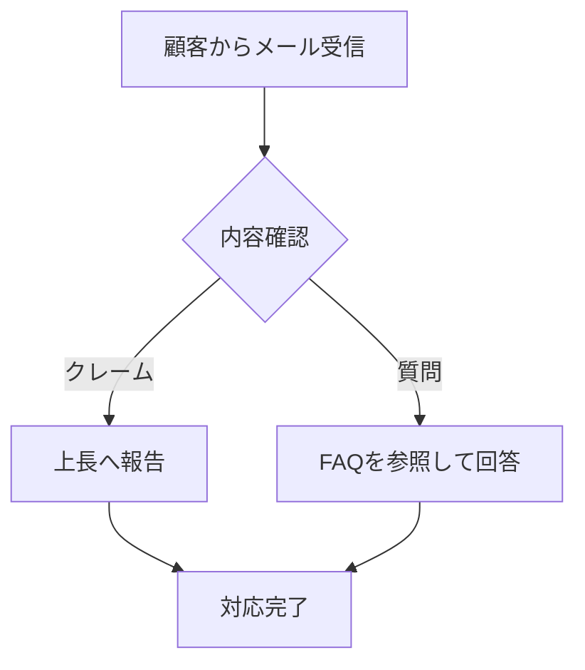

---
tags:
  - マニュアル作成
  - 技術バイブル
  - AI活用
  - 案件獲得
  - Python
  - 業務効率化
  - 00ルール
  - 深層対話
date: 2026-01-15
source: Analysis of AI Manual Automation
---

# [[2026-01-15_AIマニュアル作成技術バイブル_深層対話]]

[[2026-01-15_AIマニュアルツール機能要件・改善提案書|⬅️ 機能提案書へ]] | [[00_営業・マーケティング知識一覧|📂 営業知識一覧]]

> [!IMPORTANT]
> **本書の目的**
> 企業における「マニュアル作成」という、一見地味だが極めて需要の高い業務を、AIとPythonで「爆速化」し、それを高単価で販売するための全知識を体系化する。
> 「暗黙知の形式知化」というコンサルティング領域から、具体的なコード実装（python-pptx, Mermaid）、そして案件獲得戦略までを網羅する。

---

## 👥 登場人物（エキスパート）

*   **ユニコ (AI Business Architect)**: 進行役。AIを使って「面倒くさい」を「金脈」に変える錬金術師。
*   **プロフ・システム (The Systemizer)**: トヨタ生産方式や業務改善に精通した、ベテランのマニュアル職人。「読まれないマニュアルはゴミだ」が口癖。
*   **テック (Tech Wizard)**: Pythonでドキュメント生成を自動化するエンジニア。Markdownからスライドを自動生成する技術を持つ。

---

# 第1章：なぜ今、「マニュアル作成代行」がブルーオーシャンなのか？

**ユニコ**: 世の中はDXだ、AIだと言っているけれど、現場の実態はどう？

**プロフ**: 酷いものです。多くの企業では、業務知識が「ベテラン社員の頭の中」にしかありません。「Aさんが休むと、発注業務が止まる」というリスク（属人化）を抱えています。経営者はこれを何とかしたいが、社員は忙しすぎてマニュアルを書く暇がない。

**ユニコ**: そこで「代行」の出番ね。でも、ただ「文字起こしします」じゃ安いわよね？

**プロフ**: はい。「代書屋」ではダメです。「業務整理コンサル」である必要があります。混沌とした業務を整理し、**「誰がやっても同じ結果が出る仕組み（再現性）」** を納品する。これなら30万でも安いくらいです。

**テック**: そして、それを支えるのがAIです。人間が「整理」して、AIが「執筆」する。この分業ができれば、従来の10倍の速度で納品できます。

---

# 第2章：マニュアル作成に必要な「3つのコアスキル」

AIツールを使う前に、人間が持っておくべきスキルがあります。

## 2-1. 暗黙知抽出（インタビュー力）
**プロフ**: AIに「マニュアル書いて」と言っても、AIは御社のルールを知りません。

*   **So What? (だから何？)**: 「月末に処理します」と言われたら、「具体的に何日？ 30日？ 最終営業日？」と突っ込む。
*   **Exception (例外は？)**: 「基本はこのフローですが、イレギュラーはありますか？」と必ず聞く。

この「突っ込み」こそが、AIにはできない人間の付加価値です。

## 2-2. 構造化能力 (Structuring)
**テック**: 箇条書きを「論理構造」に直す力です。

*   **時系列 (Chronological)**: 手順1 → 手順2 → 手順3
*   **分岐 (Conditional)**: YesならAへ、NoならBへ
*   **並列 (Parallel)**: AとBを同時に行う

AIに指示を出す時も、この構造で渡してあげると精度が段違いになります。我々が作った `generator.py` の `Structure Options` 機能は、まさにこれをAIにやらせるものです。

## 2-3. 視覚化能力 (Visualization)
**ユニコ**: 文字だけのマニュアルなんて誰も読まないわ。

*   **フローチャート**: 業務の流れを図にする。
*   **スクリーンショット**: 操作画面を見せる。
*   **概念図**: 仕組みをポンチ絵にする。

**テック**: ここは技術の出番です。「Mermaid」という言語を使えば、テキストを書くだけで自動的にフローチャートが生成されます。パワポで線を引く必要はありません。

---

# 第3章：AIマニュアル作成ツールの技術的実装 (Python Deep Dive)

ユーザーの要望にあった「AIマニュアル作成ツール」をどう実装するか、技術的に深掘りします。

## 3-1. テキストから構造を作る (Drafting)

`generator.py` で実装したように、いきなり完成品を目指さないのがコツです。

1.  **Input**: 乱雑なメモ（会議の議事録など）。
2.  **Phase 1 (Structuring)**: AIに「目次（アウトライン）」だけを作らせる。
    *   この時点で「不足している情報」をAIに指摘させるのが高度なテクニックです。
3.  **User Choice**: ユーザーが目次を確認し、Goサインを出す。
4.  **Phase 2 (Writing)**: 目次ごとに本文を執筆する。

## 3-2. スライド自動生成 (python-pptx)

「パワポで作って」という要望に応えるための秘密兵器です。

```python
from pptx import Presentation

def create_slide(title, bullet_points):
    prs = Presentation()
    slide_layout = prs.slide_layouts[1] # Title and Content
    slide = prs.slides.add_slide(slide_layout)
    
    # Title
    slide.shapes.title.text = title
    
    # Body
    tf = slide.placeholders[1].text_frame
    for point in bullet_points:
        p = tf.add_paragraph()
        p.text = point
            
    prs.save('manual.pptx')
```

**テック**: これを使えば、AIが出力したテキストを解析して、一瞬で100枚のスライドを生成できます。デザインは後から「スライドマスター」で一括変更すればいいので、作業時間は実質ゼロです。

## 3-3. フローチャート自動生成 (Mermaid)

業務フロー図を自動化します。AIに以下の形式で出力させます。



これを `st.mermaid()` で表示すれば、その場で修正可能なフロー図の完成です。

---

# 第4章：外注化しても品質を落とさない「仕組み」

「人によって精度が変わる」問題をどう解決するか。

## 4-1. 「選択式」ディレクション
**ユニコ**: 初心者に「いい感じに書いて」は禁句よ。

*   **Bad**: 「このメモを元にマニュアルにして」
*   **Good**: 「ツールにメモを入れると、A/B/Cの3案が出るから、一番わかりやすいものを『選んで』ボタンを押して」

「書く（Creating）」はスキル差が出るが、「選ぶ（Selecting）」はスキル差が出にくい。これがツールの肝です。

## 4-2. テンプレートの強制
**プロフ**: 出力フォーマットをガチガチに固めます。

1.  **目的（Why）**: 何のための業務か？
2.  **対象者（Who）**: 誰がやるのか？
3.  **手順（How）**: ステップバイステップ
4.  **判断基準（Criteria）**: OK/NGのライン
5.  **例外処理（Exception）**: トラブル時はどうするか

この「5点セット」が埋まっていないと完了できないようにシステム側で制御します。

---

# 第5章：この自動化を「商品」として売る戦略

**ウルフ**: 技術があっても売れなきゃゴミだ。どうやって金を稼ぐか話そう。

## 5-1. 「納品物」のパッケージング
単なるPDFファイルは「データ」だが、バインダーに綴じられた紙は「マニュアル」に見える。

*   **物理納品**: 印刷して、テプラで背表紙をつけ、高級なファイルに入れて納品する。これだけで「+5万円」取れる。
*   **動画マニュアル**: マニュアルの要点を読み上げた動画（Vrewなどで自動生成）をつける。これで「研修パッケージ」に早変わりだ。

## 5-2. クラウドワークスの「穴場」
「マニュアル作成」カテゴリは激戦区だが、「業務改善・コンサル」カテゴリは単価が高い。

*   **ターゲット**: 「急成長中のベンチャー」か「代替わりしたばかりの2代目社長」。
*   **訴求点**: 「社員教育の自動化」を売り込む。「社長が毎回教える時間をゼロにします」と言えば、30万即決だ。

## 5-3. フロントエンドとしての利用
マニュアル作成で懐に入り込むと、会社の「裏事情（業務フロー）」が全て見える。
そこから、「ここの業務、無駄ですね。システム化しましょうか？」と、本業の「Sales Automation Tool」の提案に繋げる。これが **「トロイの木馬」戦略** だ。

---

# 終わりに

**ユニコ**: マニュアル作成は「地味」だけど、企業の「OS（オペレーティングシステム）」を作る尊い仕事よ。
そして、AIとツールを使えば、それを劇的に効率化できる。

**テック**: ツール (`Manual_Creation_Tool`) はすでに私が作っておきました。あとはあなたがクライアントを見つけてくるだけです。

**プロフ**: 良いマニュアルは、現場を救います。あなたの作ったマニュアルで、残業して苦しんでいる誰かが定時に帰れるようになる。そう信じて提案してください。
